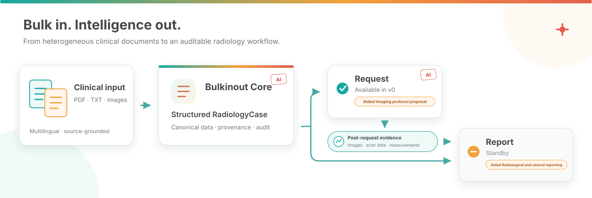

# Bulkinout


[](LICENSE.md)
[](https://github.com/Thibescobar/bulkinout/actions/workflows/ci.yml)


**Bulk in. Intelligence out.** Bulkinout turns heterogeneous clinical documents into an auditable radiology case designed to support workflows before and after imaging. The current release implements Request: it combines versioned reference data, an LLM, and deterministic safeguards to prepare an imaging proposal and a teleradiology request. Report is the planned post-exam counterpart and is not implemented in v0.



> **Decision support, not autonomous prescribing.** The v0 reference is marked `needs_local_validation`. Every prescription and transmission requires qualified human review.

## Why Bulkinout

Clinical information arrives across letters, emergency notes, laboratory results, prior reports, and images. Bulkinout consolidates these inputs into one structured case while preserving the status, provenance, and uncertainty of each fact.

This shared case is designed to support two complementary workflows:

- **Request — available in v0:** prepares an imaging proposal and a French teleradiology request for human approval.
- **Report — planned:** will support assisted radiological and clinical reporting after image acquisition.

The current Request workflow:

- identifies matching radiology scenarios;
- asks only questions that may change the decision;
- optionally collects required answers in a private local browser form;
- compares candidate examinations;
- blocks unsafe or under-specified proposals;
- prepares an evidence-backed French handoff for remote radiologist review.

## What v0 supports

```text
PDF / TXT / Markdown / images
└── Bulkinout Core
    ├── multimodal extraction
    ├── canonical clinical facts
    ├── provenance and contradictions
    └── structured RadiologyCase
        ├── Request — available in v0
        │   ├── multilingual scenario matching
        │   ├── file-based or interactive clarification
        │   ├── proposal / abstention / clarification
        │   └── cited teleradiology review handoff
        └── Report — standby
            └── future post-exam workflow
```

## Quick start

```bash
conda create --name bulkinout python=3.11 -y
conda activate bulkinout
python -m pip install -e ".[dev]"
cp .env.example .env               # or export the variables manually
export OPENAI_API_KEY="..."
export BULKINOUT_MODEL="<compatible-model>"
```

Run the complete pre-exam workflow:

```bash
bulkinout request run --input input --output output
```

Add `--interactive` to open a short-lived browser form when required clinical answers are missing. All currently known required questions appear together. After submission, the same page remains open while Request is recalculated without extracting the source documents again, then displays the examination proposed to the radiologist or the direct-escalation state.

```bash
bulkinout request run --input input --output output --interactive
```

Without interactive mode, the terminal lists every required or blocking question and points to `answers.template.json`. Complete it, save it as `answers.json`, and rerun:

```bash
bulkinout request run \
  --input input \
  --answers answers.json \
  --output output_after_answers
```

## Command line

```text
bulkinout
├── core
│   └── structure     Structure documents without running Request
├── request
│   ├── run           Run the complete pre-exam workflow
│   ├── catalog       Inspect the configured scenarios
│   ├── golden        Validate scenarios without an LLM
│   └── evaluate      Evaluate saved E2E artifacts without an LLM call
└── report            Display the Report standby notice
```

### Commands and arguments

| Command&nbsp;/&nbsp;subcommand | Command&#8209;line&nbsp;argument | Default | Purpose |
|---|---|---|---|
| `core structure` | `--input` | `input` | Directory scanned recursively for supported documents. |
|  | `--output` | `output` | Directory receiving Core JSON outputs. |
|  | `--model` | extraction&nbsp;→&nbsp;shared&nbsp;env | Model used for structured extraction. |
| `request run` | `--input` | `input` | Directory containing the clinical source documents. |
|  | `--output` | `output` | Directory receiving all workflow outputs. |
|  | `--answers` | none | Optional JSON answers from a previous clarification pass. |
|  | `--interactive` | off | Open a private loopback browser form and recalculate Request from the same Core result. |
|  | `--reference` | packaged&nbsp;reference | Optional scenario-directory override. |
|  | `--extraction-model` | extraction&nbsp;env | Model used by Core. |
|  | `--decision-model` | decision&nbsp;env | Model used by Request. |
|  | `--model` | shared&nbsp;env | Optional shared fallback for both stages. |
| `request catalog` | `--reference` | packaged&nbsp;reference | Optional reference directory to summarize instead. |
| `request golden` | `--cases` | `tests/golden` | Directory containing deterministic golden cases. |
|  | `--reference` | packaged&nbsp;reference | Optional reference override evaluated by the golden cases. |
| `request evaluate` | `--case` | required | E2E fixture directory containing `expected.json`. |
|  | `--run` | required | Directory containing saved Request artifacts. |
|  | `--report` | none | Optional path for a machine-readable evaluation report. |

Here, extraction env, decision env, and shared env mean `BULKINOUT_EXTRACTION_MODEL`, `BULKINOUT_DECISION_MODEL`, and `BULKINOUT_MODEL`, respectively. The CLI currently uses the built-in OpenAI adapters, so `core structure` and `request run` require `OPENAI_API_KEY`. Each stage resolves its model in this order: stage-specific option, shared `--model`, stage-specific environment variable, then the shared environment variable. Use `bulkinout COMMAND --help` and `bulkinout COMMAND SUBCOMMAND --help` for the current parser definition.

## Python integration

Bulkinout exposes the same complete Request workflow through a small public Python API. Computation and file output are separate, so applications can inspect the typed result in memory before deciding whether to persist it. There is no HTTP API.

```python
from pathlib import Path

from bulkinout import run_request, write_request_outputs

result = run_request(
    Path("input"),
    extraction_model="<multimodal-model>",
    decision_model="<decision-model>",
)

print(result.imaging_decision.decision_status)
print(result.teleradiology_request.model_dump(mode="json"))

# Optional: write the JSON snapshots and HTML review handoff produced by the CLI.
write_request_outputs(result, Path("output"))
```

With its defaults, this path uses the packaged 18-scenario reference and requires `OPENAI_API_KEY`. Pass `reference_dir=Path("reference/scenarios")` only to select an explicit override. Python callers can instead inject provider-neutral extraction and decision components, including local implementations; see the [Python API guide](docs/python-api.md#custom-and-local-llm-components). `run_request()` still owns Core, optional answers, reference matching, the decision model, and all deterministic guards. Expected application failures derive from `BulkinoutError`; provider and schema exceptions remain available for precise upstream handling.

## Generated outputs

| File | Purpose |
|---|---|
| `radiology_case.json` | Longitudinal container with clinical data, workflow products, artifacts, and audit events. |
| `llm_extraction.json` | Raw structured extraction returned by Core. |
| `case.json` | Current structured `ClinicalCase` view used by Request. |
| `reference_context.json` | Matched scenarios, candidate examinations, questions, and triggered rules. |
| `missing_questions.json` | Deduplicated generic, reference, model-generated, and modality-specific questions. |
| `imaging_decision.json` | Candidate comparison, decision status, rationale, and approval readiness. |
| `teleradiology_request.json` | French clinical request draft awaiting human validation. |
| `answers.template.json` | Machine-readable template for a clarification pass. |
| `run_manifest.json` | Package, code, input, component, prompt, schema, and reference fingerprints for comparison. |
| `radiology_handoff.json` | Structured proposal or escalation package linking facts, clarifications, rules, safety checks, and references. |
| `radiology_handoff.html` | Self-contained French review page intended for the remote radiologist. |
| `answers.interactive.N.json` | Private typed answer record created only by an interactive clarification round. |

## Tests and validation

```bash
ruff check src tests
ruff format --check src tests
mypy
pytest -q
bulkinout request golden --cases tests/golden --reference reference/scenarios
python -m build
```

Pytest enforces at least 95% coverage. CI checks lint, formatting, strict typing, package construction, Python 3.11 and 3.14, and golden cases. `tests/e2e/` contains 12 synthetic French, English, bilingual, and image-based records for manual runs with a real model. Start with its [six-case quick smoke suite](tests/e2e/README.md#suggested-manual-suites), then evaluate each saved run without another model call:

```bash
bulkinout request evaluate \
  --case tests/e2e/case_001_rlq_complete \
  --run output_e2e/case_001 \
  --report output_e2e/case_001/evaluation.json
```

The evaluator checks Core and Request independently with structured assertions and tolerances. It complements, but does not replace, radiologist review with the template in `review/`.

## Documentation

| Need | Document |
|---|---|
| Guided tour and reading paths | [`docs/README.md`](docs/README.md) |
| Prioritized defects, limitations, and future milestones | [`docs/roadmap.md`](docs/roadmap.md) |
| Components, data flow, boundaries, and invariants | [`docs/architecture.md`](docs/architecture.md) |
| Ingestion, extraction, provenance, and case construction | [`docs/core.md`](docs/core.md) |
| Models, statuses, and serialized data | [`docs/data-model.md`](docs/data-model.md) |
| Decision sequence, clarification, and safeguards | [`docs/request.md`](docs/request.md) |
| Interactive questions and teleradiology handoff | [`docs/interactive-handoff.md`](docs/interactive-handoff.md) |
| Scenario YAML, matching, rules, and authoring | [`docs/reference.md`](docs/reference.md) |
| Complete CLI behavior and troubleshooting | [`docs/cli.md`](docs/cli.md) |
| Python services, results, persistence, and errors | [`docs/python-api.md`](docs/python-api.md) |
| Development workflow and common change paths | [`docs/development.md`](docs/development.md) |
| Configuration, data handling, and safety boundaries | [`docs/operations.md`](docs/operations.md) |
| Automated, golden, and end-to-end testing | [`docs/testing.md`](docs/testing.md) |
| Module and function inventory | [`docs/code-reference.md`](docs/code-reference.md) |

## Language handling

Clinical input is language-agnostic. Internal keys and canonical values use English. French remains the presentation language for current clinical users and is preserved alongside English in matching synonym lists. The complete policy is recorded in [`AGENTS.md`](AGENTS.md).

## Limitations

- **LLM-dependent extraction and decision support:** results vary with the configured model. The E2E evaluator makes saved runs comparable, but coverage remains synthetic and deterministic guards do not validate every clinical statement produced by the model.
- **No dedicated terminology normalization:** canonical field names are defined, but free-text concepts are not yet mapped through a controlled clinical terminology service.
- **Limited reconciliation and timeline logic:** contradictions are represented, but v0 has no specialized longitudinal merge engine or event timeline.
- **Reference scope and validation:** the bundled 18 scenarios are examples marked `needs_local_validation`, not a complete or locally approved imaging policy.
- **Simple reference paths:** matching reads first-level `section.field` values and does not traverse arbitrary nested clinical structures.
- **No HTTP service:** the complete workflow has a public Python API. The optional loopback form is a short-lived local UI, not an authenticated service endpoint; transport, request isolation, persistence, and HTTP API contracts are not implemented.
- **No post-exam workflow:** `Report`, image-analysis integration, findings, impression, and final-report generation are placeholders.
- **Human approval is external:** interactive answers record a declared role but do not authenticate or sign it. Radiologist acceptance, persistent approval, transmission, and clinical-system integration remain external.

The prioritized remediation sequence and exit criteria are maintained in the [`roadmap`](docs/roadmap.md).

## License

Apache-2.0; see [`LICENSE.md`](LICENSE.md).
