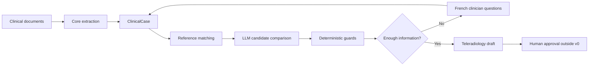

# Bulkinout documentation

This documentation explains both what v0 does and how its pieces cooperate. Start with the mental model below, then follow the reading path closest to your task.

## The system in one minute

Bulkinout receives a directory of heterogeneous clinical documents. Core extracts source-grounded facts into a shared `RadiologyCase`. Request combines that case with YAML scenarios and an LLM, then applies deterministic guards before creating a French teleradiology request draft.



Three ideas are central:

1. **Evidence remains traceable.** A clinical fact includes status, confidence, and source excerpts; it is not just a bare value.
2. **The LLM does not own safety.** It proposes structured extraction and decisions, while deterministic code prevents selection when required information remains unresolved.
3. **Internal data and presentation are separate concerns.** Technical metadata and canonical concepts use English. Current clinical interaction is in French. Source documents may use any language.

## Choose a reading path

### Understand the full workflow

1. [Architecture](architecture.md) for components, dependency direction, and the end-to-end sequence.
2. [Data model](data-model.md) for the objects passed between layers.
3. [Core](core.md) and [Request](request.md) for detailed processing.
4. [Reference](reference.md) for deterministic scenario behavior.

### Run or troubleshoot the software

1. [CLI](cli.md) for commands, options, output files, and expected failures.
2. [Python API](python-api.md) for public services, typed results, persistence, and errors.
3. [Operations and safety](operations.md) for configuration, data handling, and production gaps.
4. [Testing](testing.md) for automated, golden, and manual validation.

### Change the software

1. [Development](development.md) for setup, code ownership, common change recipes, and validation.
2. [Code reference](code-reference.md) for the module and function inventory.
3. The repository-level [`AGENTS.md`](../AGENTS.md) for contribution and language rules.

## Vocabulary

| Term | Meaning in this repository |
|---|---|
| Core | Language-agnostic document ingestion and structured fact extraction. |
| Request | Implemented pre-exam workflow that prepares an imaging proposal and referral draft. |
| Report | Reserved post-exam workflow; no processing is implemented in v0. |
| `RadiologyCase` | Longitudinal container shared by current and future workflows. |
| `ClinicalCase` | Current structured clinical facts used by Request. |
| Reference | Versioned YAML scenarios containing matching terms, questions, candidates, and simple rules. |
| Golden case | Deterministic YAML fixture that checks reference behavior without an LLM. |
| Decision guard | Code that prevents a selected state when a required discriminator is unresolved. |
| Human approval | Clinical validation step outside the current implementation. |

## Repository map

```text
bulkinout/
├── src/bulkinout/
│   ├── core/                 ingestion, extraction, models, case construction
│   ├── request/              reference, decision, guards, request generation
│   ├── report/               post-exam placeholder
│   ├── cli.py                command parsing and status display
│   ├── errors.py             public application exception hierarchy
│   ├── output.py             JSON snapshot writers
│   └── types.py              shared JSON-compatible types
├── reference/
│   ├── scenarios/            18 versioned YAML scenarios
│   └── catalog.json          generated scenario summary
├── tests/
│   ├── test_*.py             deterministic pytest suite
│   ├── golden/               reference behavior fixtures
│   └── e2e/                  synthetic records for real-LLM manual review
├── review/                   radiologist review template
└── docs/                     technical documentation
```

## v0 boundaries

`core/normalization/`, `core/reconciliation/`, `core/timeline/`, `core/audit/`, and `report/` reserve architectural boundaries but contain no substantial domain implementation. The active audit trail is `RadiologyCase.audit`, populated during Core and Request execution. The current product is a proof of concept, not a validated medical device or production clinical service.
