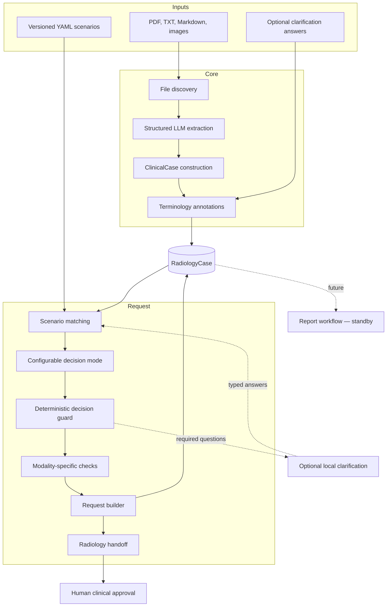
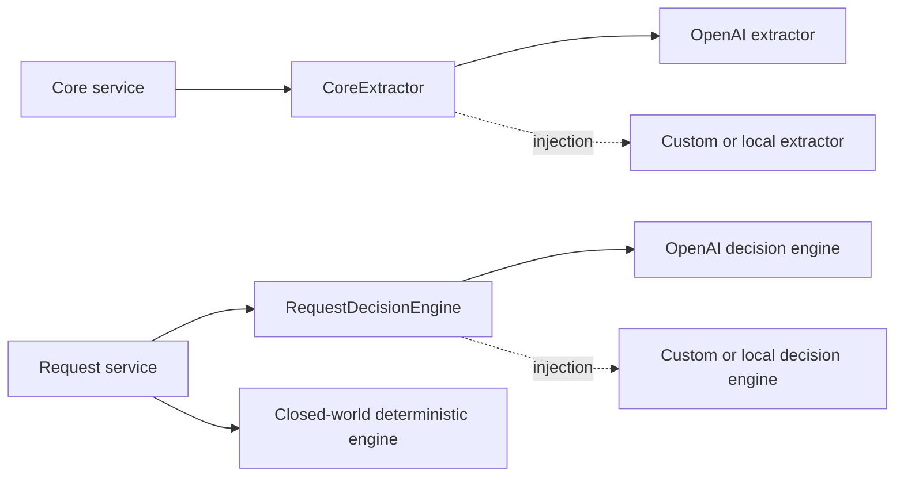
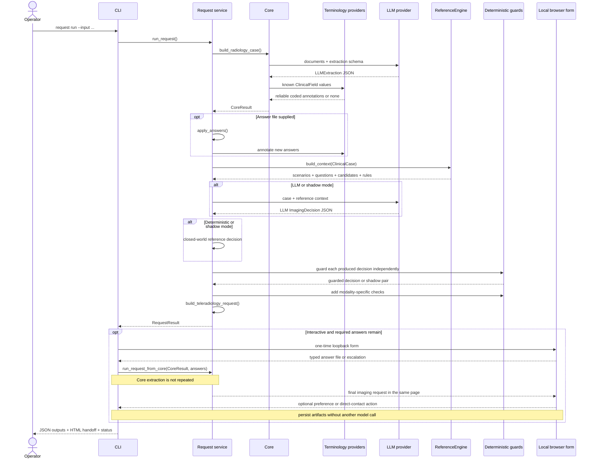

# Architecture

## Purpose and boundaries

Bulkinout separates information extraction from radiology workflow decisions. Core creates a reusable longitudinal record; Request consumes that record for the pre-exam workflow; Report is reserved for future post-exam processing.



The architecture does not claim that an LLM output is trustworthy by itself. It makes model output explicit, typed, inspectable, and subject to deterministic state transitions and human review.

## Component responsibilities

### Core

Core owns document ingestion and clinical fact representation. It:

1. recursively discovers supported files;
2. sends text, images, and uploaded documents to the configured model;
3. validates the structured response as `LLMExtraction`;
4. maps recognized `section.field` facts into `ClinicalCase`;
5. adds conservative provider-backed terminology annotations;
6. stores artifacts and an audit event in `RadiologyCase`.

Core must not choose an examination. Keeping that boundary allows the same record to support Request today and Report later.

### Request

Request owns pre-exam decision support. It:

1. applies optional clinician answers as sourced observed facts;
2. identifies generic missing information;
3. matches up to three relevant reference scenarios;
4. runs the requested LLM, deterministic, or shadow decision mode;
5. merges generic, required reference, model-generated, and modality-specific questions;
6. rejects a selected state when a required or blocking question is unresolved;
7. builds a French teleradiology request draft, evidence-backed radiology handoff, and reproducibility manifest.

The CLI may collect one clarification round through a short-lived loopback browser form. Its answers are persisted as a typed input file, then only Request is recalculated from an immutable Core baseline. This UI is an adapter around the application services, not workflow state owned by Core.

Request may import Core models. Core must never import Request. This one-way dependency prevents pre-exam rules from leaking into the shared clinical record.

### Terminology boundary

Core depends on the small `TerminologyProvider` protocol rather than a terminology server, licensed dataset, or DICOM library. `TerminologyNormalizer` annotates `ClinicalField.coded_concepts`; it never replaces `ClinicalField.value`, source wording, or provenance. The built-in pipeline recognizes a limited set of UCUM units. SNOMED CT, LOINC, and RadLex content must come from an explicitly configured provider whose licensing and version are controlled by the deploying organization.

Request reapplies the same normalizer after clinician answers are added. This operates on Request's deep copy and does not repeat extraction or mutate the Core baseline. Existing reference rules remain value-based unless a scenario explicitly uses `concept_is` or `concept_in`.

### Report

`src/bulkinout/report/` currently contains no post-exam processing. The corresponding fields in `RadiologyCase` reserve space for acquisition metadata, AI results, radiologist observations, findings, impression, and a final report. Their presence is an architectural promise, not implemented behavior.

## LLM provider boundary

Application services depend on two structural protocols rather than a provider SDK:



`CoreExtractor` accepts source paths and returns `LLMExtraction`. `RequestDecisionEngine` accepts a `ClinicalCase`, unresolved questions, and `ReferenceContext`, then returns `ImagingDecision`. OpenAI remains the default decision implementation, but Request can instead use its closed-world `DeterministicRequestDecision` or execute both in shadow mode. Python callers may inject the extraction component and the LLM decision slot independently. Provider-specific transport, prompts, credentials, and response parsing stay inside adapters. Reference matching, deterministic guards, request construction, and human-approval boundaries remain in Bulkinout services and cannot be replaced through these interfaces.

Shadow mode applies the same guards to both decisions but keeps them independent. Only the LLM branch builds the active request and handoff; the deterministic branch produces evaluation artifacts. Core extraction runs once in every mode.

## End-to-end sequence



If clarification is necessary, the operator either uses `--interactive` or completes `answers.template.json` and starts a new run with `--answers`. Interactive mode retains the Core result only in the current process; the answer file remains the auditable handoff between calculations. The same short-lived session can then persist all imaging options, an optional clinician preference, or a direct-contact action. There is no durable or remote server-side session and no order transmission.

A separate `request evaluate` command reads one saved run and its schema-v1 E2E expectations. It performs no model call and attributes structured assertion failures to Core or Request. The schema-v5 run manifest fingerprints the distributed Python source, inputs, executed decision engines, terminology providers, and applied inference settings, so changed safeguards, terminology maps, or sampling configuration cannot retain the same run identity. The evaluator does not turn synthetic assertions into clinical validation.

## Trust boundaries

| Boundary | Untrusted or variable side | Enforced side |
|---|---|---|
| Documents → extraction | Source format, wording, completeness | Supported extensions and Pydantic response schema |
| LLM → clinical case | Model interpretation and omissions | Typed fields, statuses, confidence, provenance |
| Clinical field → terminology | Synonyms, ambiguity, terminology release | Conservative providers, original-text retention, unmapped fallback |
| Reference → decision | Scenario scope and local suitability | Versioned YAML, deterministic matching, validation tests |
| Decision engine → selected state | LLM reasoning or closed-world reference coverage | Required-question guard and modality-specific checks |
| Local form → answer fact | Declared role and clinical value | Typed input, one-time token, explicit provenance; no authenticated identity |
| Draft or handoff → clinical action | Generated wording and proposal | External qualified human approval |

Pydantic validation proves structural conformity, not clinical correctness. Golden cases prove encoded rule behavior, not guideline completeness. Human review remains a separate and mandatory boundary.

## Architectural invariants

The following rules should remain true across refactors:

- Missing information remains `unknown`; absence of mention is not converted to a negative fact.
- Every non-unknown extracted fact should carry provenance.
- Conflicting evidence is represented rather than silently resolved.
- Source language does not determine the canonical internal concept.
- Terminology annotations never replace the original value or its provenance.
- An uncertain or unavailable terminology mapping remains usable as free text.
- French matching terms are preserved when English synonyms are added.
- Required unresolved discriminators prevent `selected` and approval-ready states.
- Unknown or conflicting facts are excluded from reliable request fields.
- Human validation is never inferred from successful program execution.
- Stable IDs and public data keys are not renamed for stylistic reasons.

## State and persistence

The shared output writer creates snapshots rather than using a database. The CLI calls it automatically; Python integrations may keep `RequestResult` in memory or call `write_request_outputs()`. `radiology_case.json` is the most complete object, while the other files expose intermediate stages for inspection and debugging.

```text
source documents       immutable input supplied by the operator
answer file            optional input for a later pass
output directory       replaceable run snapshot
radiology_case.json    aggregate record for that run
intermediate JSON      evidence for debugging and review
run_manifest.json      reproducibility fingerprints for that run
radiology_handoff.*    structured and human-readable radiologist review package
answers.interactive.*  private local clarification input when requested
```

There is no concurrency control, durable workflow engine, identity model, or persistence service in v0. Production integration would need to define ownership, retention, access control, idempotency, and audit durability around these files.

## Extension points

- Extend terminology through licensed providers behind `core/normalization/`; do not couple Core to a server or DICOM object model.
- Add evidence reconciliation behind `core/reconciliation/` while preserving original provenance.
- Build a chronological view behind `core/timeline/` from dated facts and prior imaging.
- Add scenarios under `reference/scenarios/` with golden cases before changing matching behavior.
- Add an LLM provider by implementing `CoreExtractor` and/or `RequestDecisionEngine`; keep provider transport outside application services.
- Add an authenticated HTTP boundary around the public Python service only after defining request isolation, persistence, and operational error contracts.
- Implement Report against `RadiologyCase` without importing Request-specific behavior into Core.
