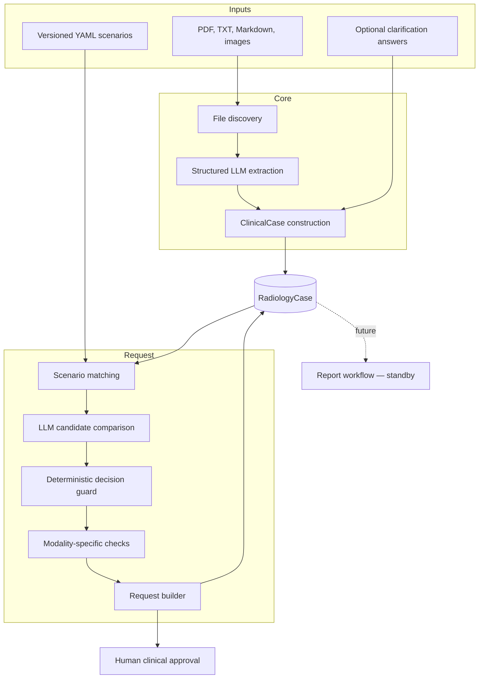
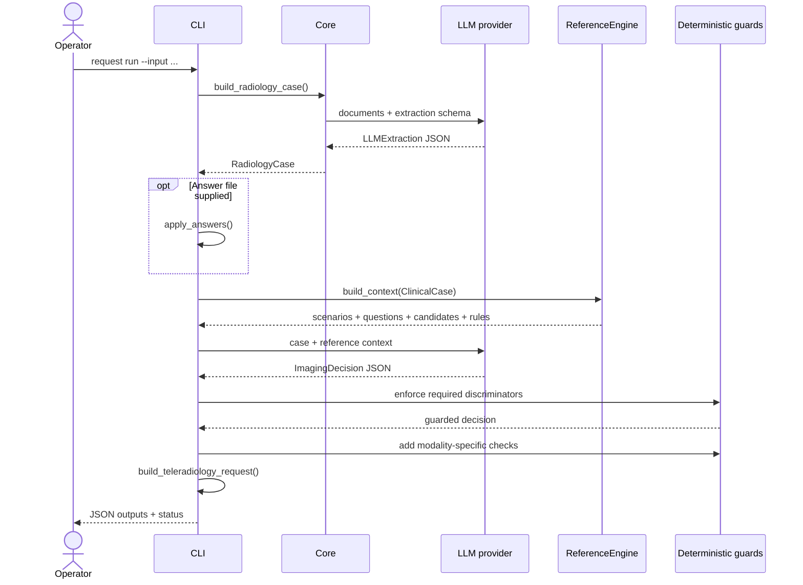

# Architecture

## Purpose and boundaries

Bulkinout separates information extraction from radiology workflow decisions. Core creates a reusable longitudinal record; Request consumes that record for the pre-exam workflow; Report is reserved for future post-exam processing.



The architecture does not claim that an LLM output is trustworthy by itself. It makes model output explicit, typed, inspectable, and subject to deterministic state transitions and human review.

## Component responsibilities

### Core

Core owns document ingestion and clinical fact representation. It:

1. recursively discovers supported files;
2. sends text, images, and uploaded documents to the configured model;
3. validates the structured response as `LLMExtraction`;
4. maps recognized `section.field` facts into `ClinicalCase`;
5. stores artifacts and an audit event in `RadiologyCase`.

Core must not choose an examination. Keeping that boundary allows the same record to support Request today and Report later.

### Request

Request owns pre-exam decision support. It:

1. applies optional clinician answers as sourced observed facts;
2. identifies generic missing information;
3. matches up to three relevant reference scenarios;
4. asks an LLM to compare candidate examinations;
5. rejects a selected state when a required discriminator is unresolved;
6. adds checks associated with the proposed modality;
7. builds a French teleradiology request draft.

Request may import Core models. Core must never import Request. This one-way dependency prevents pre-exam rules from leaking into the shared clinical record.

### Report

`src/bulkinout/report/` currently contains no post-exam processing. The corresponding fields in `RadiologyCase` reserve space for acquisition metadata, AI results, radiologist observations, findings, impression, and a final report. Their presence is an architectural promise, not implemented behavior.

## End-to-end sequence



If clarification is necessary, the operator completes `answers.template.json` and starts a new run with `--answers`. v0 does not maintain an interactive server-side session; the answer file is the handoff between passes.

## Trust boundaries

| Boundary | Untrusted or variable side | Enforced side |
|---|---|---|
| Documents → extraction | Source format, wording, completeness | Supported extensions and Pydantic response schema |
| LLM → clinical case | Model interpretation and omissions | Typed fields, statuses, confidence, provenance |
| Reference → decision | Scenario scope and local suitability | Versioned YAML, deterministic matching, validation tests |
| LLM → selected state | Candidate reasoning | Required-question guard and modality-specific checks |
| Draft → clinical action | Generated wording and proposal | External qualified human approval |

Pydantic validation proves structural conformity, not clinical correctness. Golden cases prove encoded rule behavior, not guideline completeness. Human review remains a separate and mandatory boundary.

## Architectural invariants

The following rules should remain true across refactors:

- Missing information remains `unknown`; absence of mention is not converted to a negative fact.
- Every non-unknown extracted fact should carry provenance.
- Conflicting evidence is represented rather than silently resolved.
- Source language does not determine the canonical internal concept.
- French matching terms are preserved when English synonyms are added.
- Required unresolved discriminators prevent `selected` and approval-ready states.
- Unknown or conflicting facts are excluded from reliable request fields.
- Human validation is never inferred from successful program execution.
- Stable IDs and public data keys are not renamed for stylistic reasons.

## State and persistence

The CLI writes snapshots rather than using a database. `radiology_case.json` is the most complete object; the other JSON files expose intermediate stages for inspection and debugging.

```text
source documents       immutable input supplied by the operator
answer file            optional input for a later pass
output directory       replaceable run snapshot
radiology_case.json    aggregate record for that run
intermediate JSON      evidence for debugging and review
```

There is no concurrency control, durable workflow engine, identity model, or persistence service in v0. Production integration would need to define ownership, retention, access control, idempotency, and audit durability around these files.

## Extension points

- Add deterministic normalization behind `core/normalization/` without changing document ingestion.
- Add evidence reconciliation behind `core/reconciliation/` while preserving original provenance.
- Build a chronological view behind `core/timeline/` from dated facts and prior imaging.
- Add scenarios under `reference/scenarios/` with golden cases before changing matching behavior.
- Extract Request orchestration from `cli.py` into a typed service before promising a stable Python or HTTP API.
- Implement Report against `RadiologyCase` without importing Request-specific behavior into Core.
