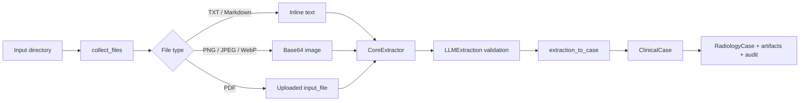

# Bulkinout Core

Core turns a directory of source documents into a structured, traceable `RadiologyCase`. It does not select an imaging examination and does not contain scenario-specific decision logic.

## Processing pipeline



The important separation is between the model response and the application record. `LLMExtraction` reflects what the model returned; `ClinicalCase` reorganizes recognized facts into the structure consumed by downstream workflows.

## Step 1: file discovery

`core.ingestion.files.collect_files(input_dir)` recursively finds supported files and returns them in sorted order.

The built-in `OpenAICoreExtractor` uses this transport. A custom `CoreExtractor` owns its own document decoding and transport.

| Extension | Default OpenAI transport |
|---|---|
| `.txt`, `.md` | Read as UTF-8 with replacement for invalid bytes, then inserted as `input_text`. |
| `.png`, `.jpg`, `.jpeg`, `.webp` | Base64-encoded as an `input_image` data URL. |
| `.pdf` | Uploaded through the OpenAI Files API, then referenced as `input_file`. |

Unsupported files, including test oracle JSON, are ignored. An empty supported-file set causes `build_radiology_case()` to raise `InputError` before any model call.

### Consequences

- Directory layout has no clinical meaning; all discovered documents are processed together.
- Sorting makes input order reproducible, but model output may still vary.
- Inline text includes a filename marker so the model can associate evidence with a source.
- Uploaded documents leave the local process and are subject to the configured provider's handling terms. See [Operations and safety](operations.md).

## Step 2: structured extraction

The Core service depends on the `CoreExtractor` protocol, not on a provider API. An extractor exposes a stable `name` and `model`, accepts the discovered paths, and returns a validated `LLMExtraction`. `OpenAICoreExtractor` is the default implementation. It requires `OPENAI_API_KEY` plus a model from its constructor, `BULKINOUT_EXTRACTION_MODEL`, or the shared `BULKINOUT_MODEL` fallback, then uses the Responses and Files APIs with a strict JSON schema generated from `LLMExtraction`.

The prompt establishes these contracts:

- extract only facts supported by supplied documents;
- keep missing information unknown;
- distinguish observed and inferred facts;
- retain provenance for every non-unknown fact;
- preserve dates and units;
- report contradictions;
- never infer renal function or device compatibility;
- treat input language as unknown;
- use English canonical identifiers and language-independent concepts;
- retain the source wording in evidence excerpts.

Schema validation answers “does this response have the required shape?” It does not answer “is this fact clinically correct?” That second question requires test fixtures and qualified review.

## Step 3: extraction conversion

`extraction_to_case(extraction)` processes each `LLMFact.field` as a `section.key` path. Facts are accepted only for these sections:

```text
patient
current_problem
history
medications
allergies
labs
imaging_safety
```

Unknown sections or malformed paths are skipped. Accepted facts become `ClinicalField` objects with their value, status, sources, confidence, and default `validated=False` state. `prior_imaging` entries are converted separately into `PriorImaging` objects.

Example model fact:

```json
{
  "field": "current_problem.location",
  "value": "right_lower_quadrant",
  "status": "observed",
  "confidence": 0.98,
  "sources": [
    {
      "filename": "emergency_note.pdf",
      "page": 1,
      "excerpt": "Douleur prédominant en fosse iliaque droite"
    }
  ]
}
```

The canonical value can be English while the evidence excerpt remains exactly as written in the French source. This is the intended language boundary.

## Step 4: aggregate record

`build_radiology_case(input_dir, model, *, extractor=None)` coordinates discovery, extraction, and conversion. When `extractor` is omitted it constructs `OpenAICoreExtractor`; an injected extractor bypasses OpenAI configuration. Core stores provider-neutral component metadata under `ClinicalCase.metadata.extractor_manifest` so Request can fingerprint a run without importing a concrete provider. It returns a typed `CoreResult`, which remains tuple-unpackable:

```python
record, extraction, source_paths = build_radiology_case(...)
```

| Return value | Role |
|---|---|
| `record` | `RadiologyCase` containing the clinical case, artifacts, workflow state, and audit event. |
| `extraction` | Original validated `LLMExtraction`, useful for debugging model behavior. |
| `source_paths` | Exact local files included in the run. |

Each source path creates an `ArtifactRef` whose ID is `input:<filename>`, whose `artifact_type` is the file suffix, and whose `source` is the filename. Core appends `core_structuring_completed` to `RadiologyCase.audit`.

## Provenance and uncertainty

`ClinicalField.status` controls how downstream code should interpret a value:

| Status | Meaning | Downstream expectation |
|---|---|---|
| `observed` | Explicitly supported by a source. | May be used with its provenance. |
| `inferred` | Derived by the model rather than directly stated. | Treat cautiously and retain evidence. |
| `unknown` | Not available. | Ask when material; never convert to a negative. |
| `conflicting` | Sources disagree. | Do not present as a reliable fact without resolution. |

Request construction excludes unknown and conflicting fields from its reliable clinical lists. The original evidence remains available in `case.json` and `radiology_case.json` for review.

## Failure modes

| Failure | Where it occurs | What to inspect |
|---|---|---|
| No supported files | Before extraction | Input directory and supported extensions. |
| Missing model | Extractor construction | `--model`, `BULKINOUT_EXTRACTION_MODEL`, or `BULKINOUT_MODEL`. |
| Missing API key | OpenAI adapter construction | `OPENAI_API_KEY`. Custom extractors define their own configuration. |
| Upload or API error | Provider call | Connectivity, credentials, provider status, file support. |
| Invalid structured response | Pydantic validation | Model compatibility, schema, raw provider response. |
| Missing expected fact | Extraction or conversion | `llm_extraction.json`, field path, status, and provenance. |

## Current gaps

The `normalization`, `reconciliation`, and `timeline` packages are placeholders. Today, terminology selection, cross-document reconciliation, and contradiction detection depend mainly on the model. Adding deterministic implementations should preserve the raw extraction and provenance so reviewers can still trace every transformation.
