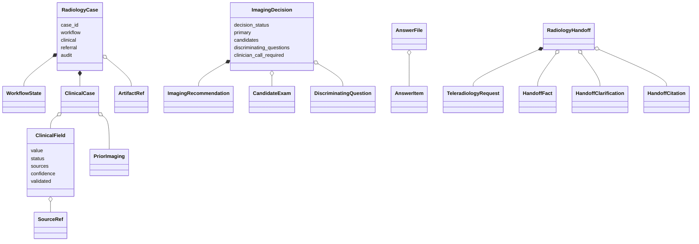
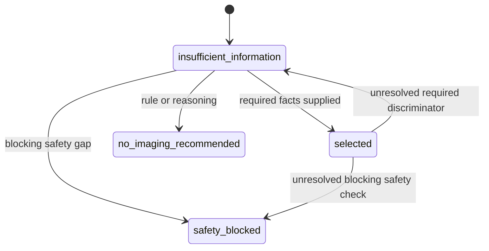

# Data model

Pydantic models in `src/bulkinout/core/models/case.py` are the contracts between ingestion, extraction, decision support, request generation, and future post-exam work.

## Model relationships



The classes fall into four groups:

| Group | Main models | Responsibility |
|---|---|---|
| Longitudinal record | `RadiologyCase`, `WorkflowState`, `ArtifactRef` | Shared container, phase, inputs, outputs, and audit. |
| Clinical evidence | `ClinicalCase`, `ClinicalField`, `SourceRef`, `PriorImaging` | Facts, uncertainty, and traceability. |
| Request decision | `CandidateExam`, `DiscriminatingQuestion`, `ImagingRecommendation`, `ImagingDecision` | Candidate comparison and guarded decision state. |
| I/O contracts | `LLMExtraction`, `LLMFact`, `LLMSource`, `AnswerFile`, `AnswerItem`, `TeleradiologyRequest` | Model response, clarification input, and clinical draft. |
| Radiologist review | `RadiologyHandoff`, `HandoffFact`, `HandoffClarification`, `HandoffCitation`, `HandoffDecisionTrace` | Evidence-backed proposal or escalation package. |

## Evidence is not a bare value

Every current clinical datum is wrapped in `ClinicalField`:

```json
{
  "value": "right_lower_quadrant",
  "status": "observed",
  "sources": [
    {
      "document_id": "llm:emergency_note.pdf",
      "filename": "emergency_note.pdf",
      "page": 1,
      "excerpt": "Douleur en fosse iliaque droite"
    }
  ],
  "confidence": 0.98,
  "validated": false
}
```

| Field | Contract |
|---|---|
| `value` | Extracted or inferred JSON-compatible content. Its runtime type depends on the clinical concept. |
| `status` | Evidence state: `observed`, `inferred`, `unknown`, or `conflicting`. |
| `sources` | Zero or more source references. Non-unknown extracted facts should normally have at least one. |
| `confidence` | Model confidence from `0.0` to `1.0`; not a calibrated clinical probability. |
| `validated` | Human-validation flag, `False` by default. v0 provides no workflow that sets it globally. |

Absence of a statement must remain unknown. For example, a document that never mentions pregnancy must not produce `value=false` for `imaging_safety.pregnancy`.

## Clinical case sections

`ClinicalCase` uses dictionaries so the field vocabulary can evolve without a model release for every new concept:

```text
ClinicalCase
├── patient
├── current_problem
├── history
├── medications
├── allergies
├── labs
├── imaging_safety
├── prior_imaging[]
└── metadata
```

A path such as `current_problem.location` means the `location` key inside the `current_problem` dictionary. These paths are shared by extraction, scenario matching, answer files, and guards; treat them as stable interfaces.

Canonical paths and structured concept values use English. Evidence excerpts preserve their source language, and current French presentation text is created at the output boundary.

## Radiology case

`RadiologyCase` is intended to survive beyond a single workflow:

| Field | v0 use |
|---|---|
| `workflow` | Starts as `phase=pre_exam`, `status=active`. |
| `clinical` | Structured `ClinicalCase`. |
| `artifacts` | Input-document references. |
| `referral` | Reference context, imaging decision, and teleradiology draft. |
| `audit` | Append-only-style event dictionaries for completed Core and Request steps. |
| `acquisition`, `ai_results`, `radiologist_observations` | Reserved for Report. |
| `findings`, `impression`, `final_report` | Reserved for Report. |

The current JSON file is a run snapshot, not a database record. Nothing enforces append-only audit storage or prevents a caller from mutating the model.

## Extraction contracts

`LLMExtraction` is the strict response expected from Core. It contains:

- `facts`: `LLMFact` entries using `section.field` paths;
- `prior_imaging`: structured dictionaries converted separately;
- `contradictions`: developer-facing descriptions of conflicting evidence;
- `document_notes`: developer-facing extraction notes.

`LLMSource` has no `document_id`; conversion creates one as `llm:<filename>` when building `SourceRef`.

## Decision contracts

### Candidate and recommendation

`CandidateExam` records a scored option with modality, body region, contrast state, arguments, and uncertainties. `ImagingRecommendation` describes a primary or secondary proposal and may include French request-facing rationale, protocol, safety considerations, assumptions, and missing information.

### Discriminating questions

A `DiscriminatingQuestion` names a stable field and records why its answer affects candidates. When `required_to_choose=True`, an unknown or conflicting target field must prevent a selected decision.

`MissingQuestion` is the merged workflow representation. `question_id` retains a stable source identifier when available; `material` marks decision relevance; `required_to_choose` prevents selection while unresolved; and `blocking` represents the strongest workflow or safety constraint. `answer_kind` selects a boolean, integer, numeric, or text browser control so canonical JSON types survive interaction. `clinical_reason` is optional French presentation content. Questions from several sources with the same field collapse to one item while preserving the strongest flags and importance.

### Decision states



| Status | Meaning |
|---|---|
| `selected` | One primary recommendation is justified, subject to human approval. |
| `insufficient_information` | Material facts are missing or conflicting. |
| `no_imaging_recommended` | The current context does not support initial imaging. |
| `safety_blocked` | A blocking safety item prevents approval readiness. |

`decision_ready_for_human_approval=True` means only that software checks permit review. It does not mean approved, prescribed, or transmitted.

## Clarification input

The shared output writer writes merged required or blocking questions as `answers.template.json`:

```json
{
  "answers": [
    {
      "question_id": "pregnancy",
      "field": "imaging_safety.pregnancy",
      "value": null,
      "note": "Une grossesse est-elle possible ou en cours ?"
    }
  ]
}
```

After a clinician supplies a non-empty value, `apply_answers()` stores it as an observed fact with confidence `1.0` and provenance pointing to the answer filename. `false` and `0` are retained; `null` and blank text remain unresolved. Interactive `AnswerItem` records may also retain the question, decision impact, declared responder role, timestamp, and response method. Their `validated` flag still remains `False`: this is evidence supplied to a new calculation, not an authenticated identity, electronic signature, or complete approval record.

## Teleradiology request

`TeleradiologyRequest` is presentation output. It contains French clinical summaries and labels, unresolved items, examination rationale, and an explicit warning. Its status is `draft`, `ready_for_human_approval`, or `blocked`, and `validated_by_clinician` defaults to `False`.

Do not treat serialization success as authorization to transmit the request. Identity, signature, persistence, and clinical-system integration are outside v0.

## Radiology handoff

`RadiologyHandoff` is an additive schema-v1 artifact designed for remote radiologist review. Its status is `ready_for_radiologist_review`, `clinician_contact_required`, or `draft`. It embeds the French request and proposal while retaining structured facts, document provenance, safety facts, clarification history, unresolved questions, decision trace, and scenario-level citations.

The JSON artifact always retains canonical English identifiers and structured values. Its HTML rendering presents French clinical labels and human-readable statuses by default, while preserving the exact canonical fields, values, confidence, validation flags, filenames, and scenario metadata in a collapsed technical trace. Source excerpts remain in their original language.

The decision trace separates applicable reference candidate IDs from model candidate IDs. `selected_reference_candidate` is populated only when the proposed examination name exactly matches an applicable YAML candidate. Triggered rules are labelled `local_rule_triggered`; citations are labelled `scenario_background`. These distinctions prevent model wording or scenario-level references from being presented as source endorsement of a patient-specific decision.

`radiology_handoff.html` renders the same content in French. It escapes every clinical value, contains no remote assets, and is intended for review rather than automatic transmission or approval.

## Evaluation and run metadata

`RunManifest` is a separate technical model rather than clinical case data. Schema version 2 records the package version and a SHA-256 fingerprint of every distributed Python source, followed by fingerprints for inputs, prompts, Pydantic schemas, the complete reference revision, and matched scenario files. It also records provider, component, and model identities. The code fingerprint changes when a safeguard or other packaged Python source changes, including uncommitted editable-install changes. Missing custom-provider metadata is explicit as `unreported`. Prompt and document contents are not copied into the manifest, although filenames can remain sensitive.

`E2EExpectations` and `EvaluationReport` define the offline model-evaluation boundary. Expectations use structured facts, tolerances, scenario/status sets, question fields, and acceptable presentation terms. Reports keep Core and Request results separate so a final-output failure is not automatically attributed to extraction.
