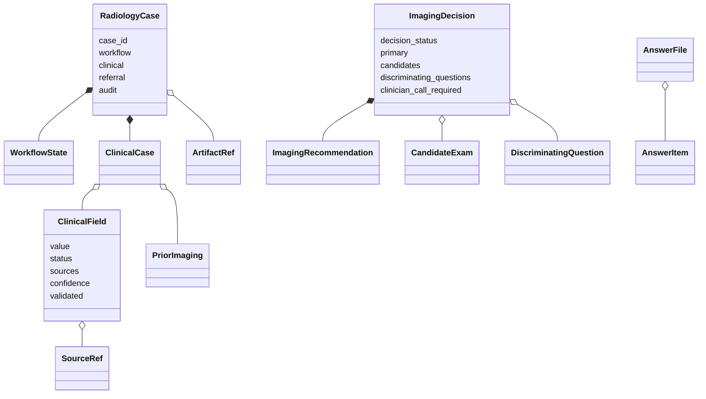
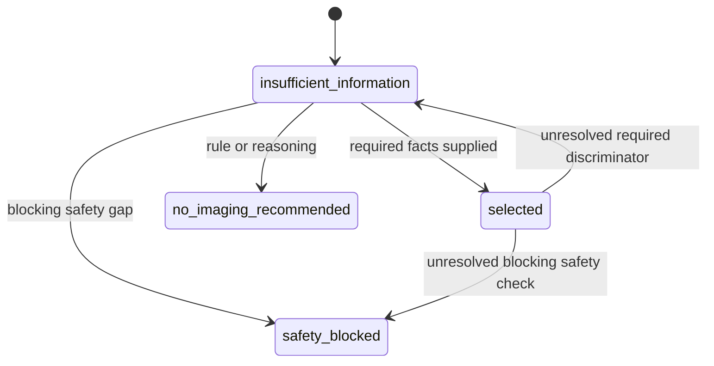

# Data model

Pydantic models in `src/bulkinout/core/models/case.py` are the contracts between ingestion, extraction, decision support, request generation, and future post-exam work.

## Model relationships



The classes fall into four groups:

| Group | Main models | Responsibility |
|---|---|---|
| Longitudinal record | `RadiologyCase`, `WorkflowState`, `ArtifactRef` | Shared container, phase, inputs, outputs, and audit. |
| Clinical evidence | `ClinicalCase`, `ClinicalField`, `SourceRef`, `PriorImaging` | Facts, uncertainty, and traceability. |
| Request decision | `CandidateExam`, `DiscriminatingQuestion`, `ImagingRecommendation`, `ImagingDecision` | Candidate comparison and guarded decision state. |
| I/O contracts | `LLMExtraction`, `LLMFact`, `LLMSource`, `AnswerFile`, `AnswerItem`, `TeleradiologyRequest` | Model response, clarification input, and clinical draft. |

## Evidence is not a bare value

Every current clinical datum is wrapped in `ClinicalField`:

```json
{
  "value": "right_lower_quadrant",
  "status": "observed",
  "sources": [
    {
      "document_id": "llm:emergency_note.pdf",
      "filename": "emergency_note.pdf",
      "page": 1,
      "excerpt": "Douleur en fosse iliaque droite"
    }
  ],
  "confidence": 0.98,
  "validated": false
}
```

| Field | Contract |
|---|---|
| `value` | Extracted or inferred JSON-compatible content. Its runtime type depends on the clinical concept. |
| `status` | Evidence state: `observed`, `inferred`, `unknown`, or `conflicting`. |
| `sources` | Zero or more source references. Non-unknown extracted facts should normally have at least one. |
| `confidence` | Model confidence from `0.0` to `1.0`; not a calibrated clinical probability. |
| `validated` | Human-validation flag, `False` by default. v0 provides no workflow that sets it globally. |

Absence of a statement must remain unknown. For example, a document that never mentions pregnancy must not produce `value=false` for `imaging_safety.pregnancy`.

## Clinical case sections

`ClinicalCase` uses dictionaries so the field vocabulary can evolve without a model release for every new concept:

```text
ClinicalCase
├── patient
├── current_problem
├── history
├── medications
├── allergies
├── labs
├── imaging_safety
├── prior_imaging[]
└── metadata
```

A path such as `current_problem.location` means the `location` key inside the `current_problem` dictionary. These paths are shared by extraction, scenario matching, answer files, and guards; treat them as stable interfaces.

Canonical paths and structured concept values use English. Evidence excerpts preserve their source language, and current French presentation text is created at the output boundary.

## Radiology case

`RadiologyCase` is intended to survive beyond a single workflow:

| Field | v0 use |
|---|---|
| `workflow` | Starts as `phase=pre_exam`, `status=active`. |
| `clinical` | Structured `ClinicalCase`. |
| `artifacts` | Input-document references. |
| `referral` | Reference context, imaging decision, and teleradiology draft. |
| `audit` | Append-only-style event dictionaries for completed Core and Request steps. |
| `acquisition`, `ai_results`, `radiologist_observations` | Reserved for Report. |
| `findings`, `impression`, `final_report` | Reserved for Report. |

The current JSON file is a run snapshot, not a database record. Nothing enforces append-only audit storage or prevents a caller from mutating the model.

## Extraction contracts

`LLMExtraction` is the strict response expected from Core. It contains:

- `facts`: `LLMFact` entries using `section.field` paths;
- `prior_imaging`: structured dictionaries converted separately;
- `contradictions`: developer-facing descriptions of conflicting evidence;
- `document_notes`: developer-facing extraction notes.

`LLMSource` has no `document_id`; conversion creates one as `llm:<filename>` when building `SourceRef`.

## Decision contracts

### Candidate and recommendation

`CandidateExam` records a scored option with modality, body region, contrast state, arguments, and uncertainties. `ImagingRecommendation` describes a primary or secondary proposal and may include French request-facing rationale, protocol, safety considerations, assumptions, and missing information.

### Discriminating questions

A `DiscriminatingQuestion` names a stable field and records why its answer affects candidates. When `required_to_choose=True`, an unknown or conflicting target field must prevent a selected decision.

### Decision states



| Status | Meaning |
|---|---|
| `selected` | One primary recommendation is justified, subject to human approval. |
| `insufficient_information` | Material facts are missing or conflicting. |
| `no_imaging_recommended` | The current context does not support initial imaging. |
| `safety_blocked` | A blocking safety item prevents approval readiness. |

`decision_ready_for_human_approval=True` means only that software checks permit review. It does not mean approved, prescribed, or transmitted.

## Clarification input

The shared output writer writes required discriminators as `answers.template.json`:

```json
{
  "answers": [
    {
      "question_id": "pregnancy",
      "field": "imaging_safety.pregnancy",
      "value": null,
      "note": "Une grossesse est-elle possible ou en cours ?"
    }
  ]
}
```

After a clinician supplies a value, `apply_answers()` stores it as an observed fact with confidence `1.0` and provenance pointing to the answer filename. Its `validated` flag still remains `False`: this is evidence supplied to a new run, not an electronic signature or complete approval record.

## Teleradiology request

`TeleradiologyRequest` is presentation output. It contains French clinical summaries and labels, unresolved items, examination rationale, and an explicit warning. Its status is `draft`, `ready_for_human_approval`, or `blocked`, and `validated_by_clinician` defaults to `False`.

Do not treat serialization success as authorization to transmit the request. Identity, signature, persistence, and clinical-system integration are outside v0.
