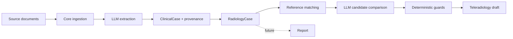

# Development guide

This guide explains how to work on Bulkinout safely and how to locate the right layer for a change. The central design constraint is that clinical extraction may be probabilistic, but workflow safeguards, reference evaluation, provenance, and approval boundaries must remain explicit and testable.

## Set up a development environment

Bulkinout requires Python 3.11 or newer. From the repository root:

```bash
python -m venv .venv
source .venv/bin/activate          # Windows: .venv\Scripts\activate
python -m pip install -e ".[dev]"
cp .env.example .env
```

The editable install exposes the `bulkinout` command while keeping imports connected to `src/`. Deterministic tests do not need credentials. The built-in OpenAI CLI path requires `OPENAI_API_KEY` and either stage-specific models or the shared `BULKINOUT_MODEL` / `--model` fallback:

```bash
export OPENAI_API_KEY="..."
export BULKINOUT_MODEL="<compatible-model>"
```

Never commit `.env`, real clinical documents, or generated output containing patient data.

## Build a mental model

All workflows share a `RadiologyCase`. Core constructs its clinical and provenance data; Request consumes that data to prepare a decision and a draft request. Report is a reserved post-exam branch and currently contains no domain workflow.



Keep the dependency direction one-way: `request` may import Core models, but `core` must never import Request. Treat the LLM result as untrusted structured input. Pydantic validates its shape; reference rules and guards constrain what the workflow may do with it. `unknown` and `conflicting` facts must not silently become negative findings.

## Find the relevant code

| Area | Main location | Responsibility |
|---|---|---|
| Command interface | `src/bulkinout/cli.py` | Parses commands, invokes services, and displays concise results |
| Request service | `src/bulkinout/request/service.py` | Owns the complete pre-exam execution order and safeguards |
| Output writers | `src/bulkinout/output.py` | Serializes Core and Request results to the documented JSON files |
| Model evaluation | `src/bulkinout/evaluation.py`, `run_manifest.py` | Fingerprints runs and checks saved Core/Request artifacts separately |
| File ingestion | `src/bulkinout/core/ingestion/` | Discovers supported input files |
| LLM contracts | `core/interfaces.py`, `request/interfaces.py` | Defines provider-neutral extraction and decision boundaries |
| Extraction | `src/bulkinout/core/extraction/llm.py` | Builds multimodal LLM input and validates structured extraction |
| Shared models | `src/bulkinout/core/models/case.py` | Defines the longitudinal case, facts, decisions, and requests |
| Core service | `src/bulkinout/core/service.py` | Creates a `RadiologyCase` from an input directory |
| Reference engine | `src/bulkinout/request/reference_engine.py` | Matches YAML scenarios, filters candidates, and evaluates rules |
| Decision support | `src/bulkinout/request/decision_llm.py` | Compares candidates using the structured case and reference context |
| Safety and completeness | `src/bulkinout/request/decision_guard.py`, `rules.py` | Blocks premature selection and creates missing questions |
| Clinical presentation | `src/bulkinout/request/request_builder.py` | Builds the French-facing teleradiology request |
| Reference content | `reference/scenarios/*.yaml` | Stores scenario matching, questions, candidates, and deterministic rules |

The full Request workflow is orchestrated by `run_request()`. Keep the CLI thin and add application behavior to the service so CLI and Python users cannot diverge. Provider adapters must stop at the typed `LLMExtraction` and `ImagingDecision` boundaries; they must not duplicate reference matching or deterministic guards. Moving a guard before or after the LLM decision can change clinical behavior.

## Follow common change recipes

### Add an LLM provider adapter

Implement the narrowest contract needed by the provider:

- `CoreExtractor` for document-to-`LLMExtraction` processing;
- `RequestDecisionEngine` for case-to-`ImagingDecision` comparison.

Keep SDK clients, credentials, message formats, document transport, and response parsing inside the adapter. Return the existing Pydantic model instead of introducing provider-shaped data into Core or Request. Do not move scenario matching, deterministic guards, or request construction into the adapter.

Test the adapter with a simulated client, then inject a small fake protocol implementation into the application service test. A real-model check belongs in `tests/e2e/` and must record the provider and model used. Adding an adapter does not establish clinical equivalence with an already evaluated model.

### Add or correct a reference scenario

Start with a focused golden case in `tests/golden/`. Then edit or add the YAML scenario and update `reference/catalog.json` when its catalog metadata changes. Preserve stable scenario IDs and rule IDs. Entry synonyms may be multilingual; add useful English terms without removing French terms that recognize existing documents.

Validate the isolated behavior before running the complete suite:

```bash
bulkinout request catalog --reference reference/scenarios
bulkinout request golden --cases tests/golden --reference reference/scenarios
pytest -q tests/test_reference_engine.py tests/test_golden.py
```

### Change extraction behavior

Update the extraction schema or prompt only when the target representation is clear. Canonical field paths and structured values use English and must not depend on the document language. Preserve source wording in provenance excerpts. Add a simulated-client unit test for parsing or conversion logic, then retain a synthetic E2E fixture when the change depends on real multimodal model behavior.

After a representative run, use `bulkinout request evaluate --case <fixture> --run <output>` and retain the generated evaluation report with its `run_manifest.json`. Compare stage-specific failures and fingerprints before accepting a model or prompt change. Do not widen an expectation merely to make a new run pass; document why the new behavior is acceptable.

### Add a safety question or decision guard

Decide whether the rule is generic, scenario-specific, or modality-specific. Put generic and modality checks in `request/rules.py`, scenario facts in YAML, and selection invariants in `decision_guard.py`. Test at least the known, unknown, and conflicting states. Verify both `decision_status` and `decision_ready_for_human_approval`; testing only the displayed question is insufficient.

### Extend a model

Add typed fields to `core/models/case.py` with safe defaults so old fixtures remain readable. Trace every serializer and consumer, particularly `radiology_case.json`, `imaging_decision.json`, E2E expectations, and the Request builder. Do not rename JSON keys or public interfaces merely for style.

### Change clinical presentation

French clinician questions, examination names, warnings, and teleradiology text are intentional presentation content. Technical metadata, identifiers, logs, help, errors, tests, and documentation remain English. Do not use a translated display string as a canonical value.

## Debug a workflow

Use the smallest deterministic boundary first. `request catalog` verifies YAML loading; `request golden` verifies matching and rules without network access; a targeted pytest file isolates Python logic. Use `pytest -q -k <term>` to select one behavior.

For an LLM-backed run, inspect artifacts in order:

1. `llm_extraction.json` — did the model extract the fact and provenance?
2. `case.json` — was the extraction converted to the expected canonical field?
3. `reference_context.json` — did the correct scenario, candidates, questions, and rules match?
4. `imaging_decision.json` — what did the decision component return?
5. `missing_questions.json` — which deterministic checks remain unresolved?
6. `teleradiology_request.json` — which reliable facts reached presentation output?

If no document is found, verify the supported suffix and the input directory. If the CLI reports a missing model, check the corresponding `--extraction-model` or `--decision-model` option and environment variable, then the shared `--model` / `BULKINOUT_MODEL` fallback. If it reports a missing key, check `OPENAI_API_KEY`. Do not paste real patient artifacts or secrets into issues, test output, or debug logs.

LLM calls are not part of the default suite and may vary across models. A successful schema validation demonstrates structural compatibility, not clinical correctness. Run the offline evaluator on saved artifacts, then record qualitative E2E findings with `review/radiologist_review_template.csv`.

## Apply style and language rules

Use four spaces, type hints on source functions, `pathlib.Path` for paths, `snake_case` for functions and modules, `PascalCase` for models, and uppercase constants. Ruff enforces formatting and a cyclomatic-complexity ceiling of 10; strict mypy settings cover `src/`. Prefer small domain helpers over nested branches.

The canonical technical language is English. Clinical input remains language-agnostic, matching dictionaries may be multilingual, and French is reserved for clinical content presented to current users. A terminology refactor must preserve existing matching and must not rename stable identifiers.

## Complete the validation checklist

Before submitting a change:

```bash
ruff check src tests
ruff format --check src tests
mypy
pytest -q
bulkinout request golden --cases tests/golden --reference reference/scenarios
python -m build
git diff --check
```

Confirm that coverage remains at least 95%, no secrets or generated patient artifacts are staged, and documentation matches the implemented behavior. For terminology, scenario, or clinical-content changes, explicitly exercise both French and English matching. For LLM-dependent changes, retain the manifest, stage-specific evaluation, and manual review evidence; do not represent deterministic CI as a real-model result.
