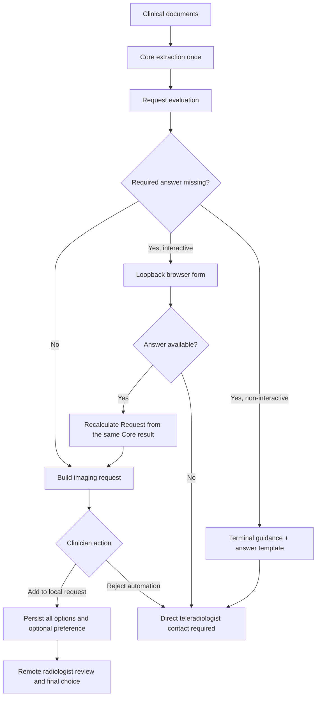

# Interactive clarification and radiology handoff

This feature connects three distinct responsibilities without treating any software state as clinical approval:

1. Bulkinout identifies information that can change or block the imaging proposal.
2. The requesting clinician may supply typed answers locally.
3. The requesting clinician may record an optional preference or reject the automation.
4. The remote radiologist receives every proposal, its protocol, and the traceable context needed for the final choice.

## Workflow



The first Request evaluation discovers reference, model-generated, and modality-specific questions. All currently known required or blocking questions appear together in one form; Request is not run between individual answers. Submitting the form changes the button state and displays an animated progress indicator while triggering a second Request evaluation, but not another Core extraction or source-document upload. The same browser session then presents the final imaging request. Recording the clinician action only updates the request and handoff artifacts: it makes no model call and sends nothing to an external system.

## Interactive mode

```bash
bulkinout request run \
  --input input \
  --output output/run_001 \
  --interactive
```

The CLI opens the review page whenever a reviewable request exists, even when no clarification is required. If a required or blocking question remains, boolean, integer, numeric, and text questions use distinct controls so canonical values retain their JSON types. Leaving a field empty records it as unavailable; it never converts missing information into an observed fact. The clinician may instead choose direct teleradiologist escalation.

The form:

- binds only to `127.0.0.1` on a random port;
- uses a high-entropy session URL token;
- contains no remote scripts, fonts, images, or analytics;
- uses one nonce-authorized inline script only for click feedback and the progress indicator;
- rejects an unexpected host, path, form shape, or oversized request;
- allows ten minutes for the complete interaction, remains open during recalculation, and closes its local server after the final clinician action;
- writes `answers.interactive.N.json` with owner-only permissions where supported.

Browser failure or timeout leaves the latest guarded result intact and returns the operator to the file-based workflow. `--interactive` and `--answers` are mutually exclusive for one invocation. A new required question discovered only after recalculation is shown in the final handoff and terminal guidance; v0 deliberately performs one bounded clarification round.

## Non-interactive mode

The default remains suitable for scripts. When answers are missing, the terminal lists the questions, identifies `answers.template.json`, and prints the required `--answers` handoff. A file-based second run still performs a complete workflow, including a new Core extraction, because it is an independent invocation.

Never run different cases into the same output directory. Existing snapshot filenames are overwritten sequentially and writes are not transactional.

## Answer trace

An interactive answer retains:

```text
question ID and canonical field
├── French question and clinical impact
├── typed answer or explicit unavailability
├── declared responder role
├── UTC timestamp
├── response method
└── answer filename used as fact provenance
```

`apply_answers()` stores non-empty answers as observed facts with confidence `1.0` and `validated=false`. `false` and `0` are valid answers. `null`, an empty string, or whitespace remains unresolved. The role and timestamp are declarations, not authentication, identity proof, or an electronic signature.

## Teleradiology review package

Every Request run writes two additive artifacts:

- `radiology_handoff.json` is the canonical schema-v2 review package;
- `radiology_handoff.html` is its escaped, self-contained French presentation.

The package contains:

- every structured imaging option and its protocol, plus the original Bulkinout ranking;
- any locally recorded clinician preference or explicit rejection of the automation;
- all known and conflicting structured facts with document provenance;
- a dedicated safety-fact view;
- answered and unanswered clarifications;
- matched scenario IDs, versions, validation statuses, candidates, and locally triggered rules;
- the model rationale and alternatives;
- reference citations and mandatory warnings.

The visible review layer uses French clinical labels, translated display values for known canonical concepts, and source wording for free-text evidence. Developer-facing field paths, raw canonical values, terminology system/code annotations, confidence, validation flags, exact answer filenames, and scenario metadata remain unchanged in JSON and are grouped under the collapsed **Afficher la traçabilité technique** section. This separation changes presentation only; it does not translate source excerpts or modify clinical data. An absent code is rendered as `unmapped` in the technical trace and does not hide the clinical value.

When a proposal is ready for review, all named `ImagingRecommendation` objects appear as uniform cards with their protocol, contrast, urgency, rationale, and attention points. The original Bulkinout preference remains labelled independently. Clicking a card marks an optional **Préférence du clinicien**; confirming **Ajouter au bon de demande** persists all options and that preference in `teleradiology_request.json` and `radiology_handoff.json`. The radiologist still makes the final choice. **Écarter la proposition et appeler le téléradiologue** records the rejection, blocks the automatic request, and retains the artifacts for audit. Neither action authenticates the clinician, transmits an order, or calls a model. Each rationale remains labelled **Éléments de justification — à vérifier** because it supports review but is not source-verified evidence. Legacy narrative alternatives remain separate notes.

The HTML presentation uses non-breaking French punctuation spacing before `?`, `!`, `:`, and `;` so punctuation cannot be orphaned at the start of a rendered line. JSON values and source data remain unchanged.

A proposed examination is linked to a YAML candidate only when its examination name exactly matches an applicable reference candidate. Model-generated candidate IDs are retained separately and must not be mistaken for validated reference IDs.

## Citation semantics

Current references are attached at scenario level. The handoff therefore labels them `scenario_background`, for example:

```text
ACR — Right Lower Quadrant Pain
Scenario: rlq_appendicitis, version 0.1.0
Reference status: needs_local_validation
Relationship: scenario_background
```

This means that the material informed the local scenario. It does not mean that the source organization approved the model output, the local encoding, or the patient-specific proposal. When a source has no explicit ID, Bulkinout derives a run-local ID such as `rlq_appendicitis:source:1` without inventing a guideline locator.

## Outcomes for the remote radiologist

`ready_for_radiologist_review` provides a proposal with its clinical evidence, clarifications, uncertainties, safety data, alternatives, and references. The radiologist still accepts, modifies, or refuses it outside Bulkinout.

`clinician_contact_required` provides no apparently approved examination. It explains why Bulkinout abstained and which questions or conflicts require direct discussion. In time-critical care, the form's escalation action must not delay direct contact.

When several supported examinations remain after clarification, the same page may instead show an unselected option set under `ready_for_radiologist_review`. This is not an escalation or an automated choice: the teleradiologist receives the alternatives, their constraints, the clinical evidence, and the reference citations, then selects the appropriate examination under local procedures.

## Security and current limits

The loopback form reduces accidental network exposure but does not secure a compromised workstation. Browser history, extensions, screenshots, local processes, and the output directory remain in the local trust boundary. The form provides no login, access control, durable session, remote collaboration, prescription, transmission, or radiologist signature.

Treat source documents, questions, answer files, JSON snapshots, and the HTML handoff as clinical data. Use only synthetic data until the data-lifecycle gate in the [roadmap](roadmap.md) is satisfied.
