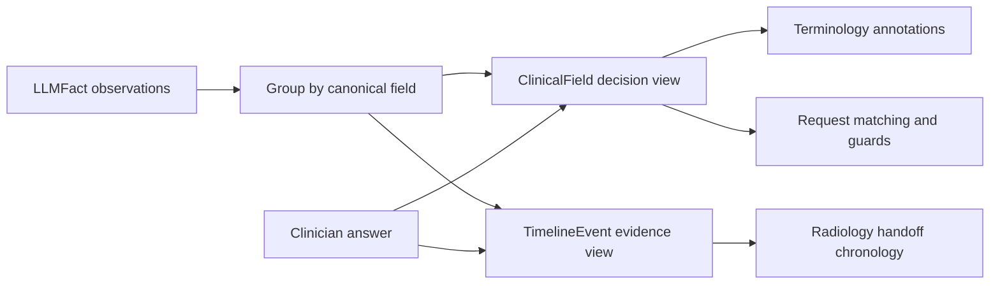

# Clinical reconciliation and timeline

Core retains repeated observations instead of letting document order decide which value survives. The implementation deliberately stops short of a general medical temporal-reasoning engine: it makes evidence and uncertainty explicit, then lets Request ask for a current answer when that distinction matters.

## Two complementary views

`ClinicalField` remains the value consumed by Request. It now carries `temporal_status` and optional `observed_at`. `ClinicalCase.timeline` contains one `TimelineEvent` per accepted extracted observation, plus prior-imaging events and later clinician answers. The timeline is an audit view, not a competing source of clinical truth.

## Temporal contract

| Status | Meaning | Request behavior |
|---|---|---|
| `current` | The source explicitly relates the observation to the current encounter. | May satisfy a current-data requirement when evidence is otherwise usable. |
| `historical` | The observation belongs to an earlier state or encounter. | Remains visible; cannot satisfy a current safety question by itself. |
| `resolved` | The source explicitly says the condition or episode resolved. | Remains visible and does not trigger an active `current_problem` scenario. |
| `unknown` | The temporal relationship is not supported clearly enough. | Remains usable as evidence, but cannot activate current-problem matching or satisfy a current safety requirement. |

`observed_at` preserves an ISO 8601 date or datetime supplied by the extractor. Missing and non-ISO source dates are not invented or interpreted. ISO dates are ordered chronologically; undated events remain visible at the end of the timeline.

## Reconciliation rules

For repeated instances of one canonical field:

1. Identical scalar values are grouped case-insensitively and all `SourceRef` objects are retained.
2. Compatible lists are combined without duplicate items.
3. Different explicitly current scalar values become `FieldStatus.conflicting`.
4. One explicitly current value may form the decision view over older values. The older observations remain in the timeline and the `explicit_current_status` method is recorded under `metadata.reconciliation.resolutions`.
5. Historical or resolved values are never promoted to current based on file order, filename, or age.
6. Prior contrast reactions, pacemakers, and metallic implants are persistent safety evidence: a newer negative statement does not silently erase a historical positive. Divergent values remain conflicting.
7. An extractor-supplied `conflicting` status is preserved even when its rendered values happen to look equal.

Deterministic conflicts are recorded under `metadata.reconciliation.conflicts` with the field, values, temporal statuses, dates, and source filenames. The original model descriptions remain under `metadata.contradictions` alongside those records.

## Safety and clarification

Request requires a `current` value for modality-dependent checks involving:

- iodinated-contrast reaction and current renal function for contrast-enhanced CT;
- pregnancy for ionizing-radiation scenarios when relevant;
- pacemaker and metallic or implanted devices for MRI.

An old, resolved, temporally unknown, or conflicting value therefore leads to clarification when the proposed modality makes it material. A required LLM discriminator is also unresolved unless it is current, except stable patient demographics and fields explicitly representing history. Anticoagulation has no universal blocking rule because its relevance depends on the proposed procedure; when a scenario or decision marks it material, the same required-question guard applies.

Reference matching and rule evaluation require `current` temporal status for `current_problem`, laboratory, medication, and imaging-safety fields. Patient demographics and explicit history retain their natural semantics; historical allergy evidence remains usable because a prior reaction is itself the safety fact being represented.

Interactive answers replace the decision view only through an explicit clinician response. They are marked current, added to the timeline, retain earlier field sources, and record an `explicit_clinician_answer` resolution. The Core baseline is still deep-copied, and `run_request_from_core()` performs no new extraction.

## Handoff

`radiology_handoff.json` schema version 3 includes `temporal_status`, `observed_at`, and `clinical_timeline`. The French HTML shows temporal labels, observation dates, contradictions, and a dedicated chronology section. Historical safety evidence remains visible even when the current proposal does not use it.

## Deliberate limits

- Temporal classification still depends on the extractor or an explicit clinician answer; Pydantic validation cannot verify clinical truth.
- Bulkinout applies no fixed “recent laboratory” duration. Local protocols and clinical context must define acceptable age.
- It does not parse ambiguous dates such as `07/09/26`, infer episode boundaries, calculate medication exposure windows, or reason about recurrence.
- Explicit `current` status is a reconciliation signal, not proof that a source is correct. Persistent safety exceptions remain conservative.
- Terminology codes annotate the reconciled decision view; timeline events retain original values and sources but do not currently receive independent coding.
