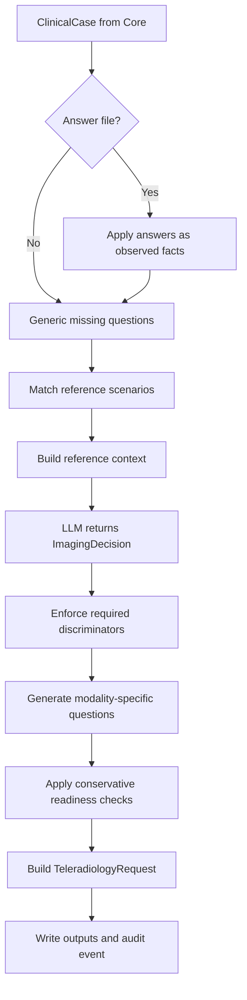

# Bulkinout Request

Request is the implemented pre-exam workflow. It consumes a `ClinicalCase`, uses the local YAML reference to constrain an LLM comparison, applies deterministic guards, and builds a French teleradiology request draft.

## Complete execution order



The orchestration lives in `run_request()` in `src/bulkinout/request/service.py`. Both the CLI and Python integrations use this service, so answer handling, guard order, and clinical behavior have one implementation.

## 1. Optional clarification answers

`load_answers()` accepts two JSON shapes:

```json
{
  "answers": {
    "imaging_safety.pregnancy": false
  }
}
```

or the full form:

```json
{
  "answers": [
    {
      "question_id": "pregnancy",
      "field": "imaging_safety.pregnancy",
      "value": false,
      "note": "Clinician-confirmed answer"
    }
  ]
}
```

`apply_answers()` accepts only recognized top-level clinical sections. It stores each value as `observed`, gives it confidence `1.0`, records the answer filename as provenance, and leaves `validated=False`. The filename is also appended to `ClinicalCase.metadata.answer_files`.

## 2. Generic completeness questions

`generic_missing_questions()` deliberately covers only two universal gaps:

| Missing field | Result |
|---|---|
| `current_problem.indication` | Critical, blocking question requesting the clinical indication and diagnostic question. |
| Both `current_problem.symptoms` and `current_problem.known_diagnosis` | High-priority, nonblocking question requesting current symptoms or signs. |

These checks are not a protocol matrix. Scenario-specific questions belong in the reference so they remain versioned, reviewable, and testable.

## 3. Reference context

`ReferenceEngine.build_context()` matches scenarios against known, nonconflicting case fields. By default it retains the top three matches and exposes, for each one:

- stable scenario ID, English title, version, and validation status;
- source guidance metadata;
- candidates whose optional `when` condition applies;
- unanswered material questions ordered by priority;
- deterministic rules triggered by the current facts.

This object is saved as `reference_context.json` and sent to the decision model. It is the best starting point when a scenario or candidate appears wrong.

## 4. LLM candidate comparison

The Request service depends on `RequestDecisionEngine`. Its default implementation, `OpenAIRequestDecision`, resolves its model from the explicit decision setting, `BULKINOUT_DECISION_MODEL`, or the shared `BULKINOUT_MODEL` fallback, then sends three inputs:

```json
{
  "clinical_case": {},
  "unresolved_questions": [],
  "reference_context": {}
}
```

Every implementation must return an `ImagingDecision`. The default prompt tells the model to use reference context as the local normative context, compare candidates, ask the minimum number of material questions, avoid fabricated safety facts, and abstain when required information is missing.

The model is still a variable component. Its schema constrains shape, not clinical truth or reproducibility. Injecting another provider does not bypass the deterministic guards that re-evaluate critical state transitions in the following steps.

## 5. Deterministic decision guard

`enforce_decision_guard()` inspects every LLM-generated discriminating question marked `required_to_choose=True`. If its target field is absent, unknown, conflicting, malformed, or outside a dictionary section, the guard forces:

```text
decision_status                  = insufficient_information
primary.recommended              = false
clinician_call_required          = true
decision_ready_for_human_approval = false
```

It also records the question in `primary.missing_information` and adds a clinician-call reason. This prevents an LLM from simultaneously selecting an examination and declaring an unanswered discriminator necessary.

For `no_imaging_recommended`, the guard sets `primary.recommended=False` and permits readiness for human review. Readiness still does not constitute clinical approval.

## 6. Modality-specific checks

Checks are generated only after a primary modality exists, avoiding irrelevant questions for every patient.

| Proposed examination | Unknown fact | Question behavior |
|---|---|---|
| Contrast CT | Prior iodinated-contrast reaction | High priority; blocks approval readiness until answered. |
| Contrast CT | Recent eGFR | High priority; blocks approval readiness until answered. |
| MRI | Pacemaker or implanted defibrillator | Critical and explicitly blocking; produces `safety_blocked`. |
| MRI | Implant or metal | High priority; blocks approval readiness until answered. |
| CT or radiography | Possible pregnancy when relevant | High priority; blocks approval readiness until answered. |

Pregnancy relevance is intentionally broad. It is skipped only for an observed male sex (`M`, `MALE`, or `HOMME`) or an observed age below 10 or above 60. Invalid age values restore the conservative default.

The Request service treats all new `critical` or `high` modality questions as material for readiness, even when their `blocking` property is false. Explicitly blocking safety questions select `safety_blocked`; other material gaps normally select `insufficient_information`.

## 7. Request construction

`build_teleradiology_request()` creates presentation output from reliable facts and the guarded decision. It excludes values whose status is `unknown` or `conflicting` and gathers:

- patient summary;
- indication, requested examination, protocol, contrast, urgency, and clinical question;
- relevant history, medication, allergies, laboratory data, and imaging safety;
- prior imaging;
- unresolved French questions;
- examination rationale.

The request status is:

| Status | Condition |
|---|---|
| `blocked` | Any blocking question exists or the decision requires a clinician call. |
| `ready_for_human_approval` | No block/callback and the decision declares review readiness. |
| `draft` | Neither of the above. |

`validated_by_clinician` remains false, and the French warning explicitly prohibits transmission without clinical validation.

## Clarification loop example

```text
Run 1
  CT with contrast proposed
  └── iodinated-contrast history unknown
      ├── imaging_decision: insufficient_information
      ├── request: blocked
      └── answers.template.json generated

Clinician response
  └── answer stored in answers.json with its field path

Run 2 --answers answers.json
  ├── documents are processed again
  ├── answer overwrites the corresponding case field
  ├── reference and LLM decision are recalculated
  └── guards evaluate the new state
```

Each pass is a fresh run. v0 does not compare runs, guarantee idempotency, or persist a conversation state.

## Debugging order

When the final draft is wrong, inspect artifacts from earliest to latest:

1. `llm_extraction.json`: did Core extract the fact and provenance correctly?
2. `case.json`: did conversion or answer application place it under the expected field?
3. `reference_context.json`: did matching expose the expected scenario, questions, candidates, and rules?
4. `imaging_decision.json`: what did the LLM propose, and which status survived the guard?
5. `missing_questions.json`: which generic or modality checks remain?
6. `teleradiology_request.json`: was reliable information assembled correctly?

This artifact-by-artifact approach identifies the owning layer before code or reference data is changed.
