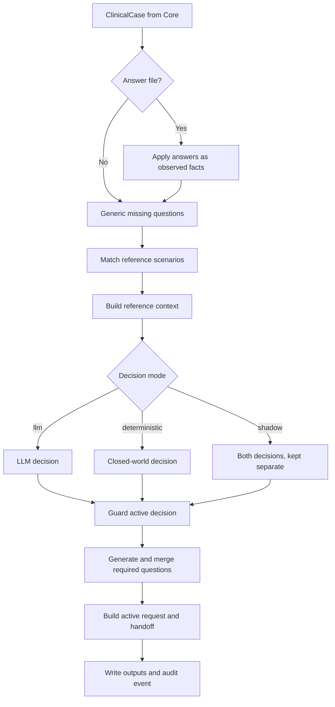

# Bulkinout Request

Request is the implemented pre-exam workflow. It consumes a `ClinicalCase`, combines it with the packaged or explicitly overridden YAML reference, runs the selected decision mode, applies deterministic guards, and builds a French teleradiology request plus an evidence-backed review handoff.

## Complete execution order



The orchestration lives in `run_request()` and `run_request_from_core()` in `src/bulkinout/request/service.py`. The first includes Core extraction; the second safely deep-copies an existing `CoreResult` and recalculates Request without processing source documents again. Both use the same answer handling, guard order, and clinical behavior.

## 1. Optional clarification answers

`load_answers()` accepts two JSON shapes:

```json
{
  "answers": {
    "imaging_safety.pregnancy": false
  }
}
```

or the full form:

```json
{
  "answers": [
    {
      "question_id": "pregnancy",
      "field": "imaging_safety.pregnancy",
      "value": false,
      "note": "Clinician-confirmed answer"
    }
  ]
}
```

`apply_answers()` accepts only recognized top-level clinical sections. It stores each non-empty value as `observed`, gives it confidence `1.0`, records the answer filename as provenance, and leaves `validated=False`. `false` and `0` remain valid typed answers; `null`, empty strings, and whitespace remain unresolved. The filename and structured clarification record are retained in `ClinicalCase.metadata`.

The CLI may generate this file through `--interactive`. The loopback browser form records the original French question, clinical impact, typed value, declared responder role, UTC timestamp, and response method. This metadata provides traceability but not authentication or signature. See [Interactive clarification and radiology handoff](interactive-handoff.md).

## 2. Generic completeness questions

`generic_missing_questions()` deliberately covers only two universal gaps:

| Missing field | Result |
|---|---|
| `current_problem.indication` | Critical, blocking question requesting the clinical indication and diagnostic question. |
| Both `current_problem.symptoms` and `current_problem.known_diagnosis` | High-priority, nonblocking question requesting current symptoms or signs. |

These checks are not a protocol matrix. Scenario-specific questions belong in the reference so they remain versioned, reviewable, and testable.

## 3. Reference context

`ReferenceEngine.build_context()` matches scenarios against known, nonconflicting case fields. By default it retains the top three matches and exposes, for each one:

- stable scenario ID, English title, version, and validation status;
- source guidance metadata;
- candidates whose optional `when` condition applies;
- unanswered material, required, and blocking questions ordered by priority;
- deterministic rules triggered by the current facts.

This object is saved as `reference_context.json` and passed to the configured decision engine or engines. It is the best starting point when a scenario or candidate appears wrong.

## 4. Decision modes

`decision_mode` accepts `llm`, `deterministic`, or `shadow`; `llm` remains the default.

| Mode | Request decision | Second LLM call | Active request and handoff |
|---|---|---|---|
| `llm` | `OpenAIRequestDecision` or an injected engine | One | LLM decision |
| `deterministic` | `DeterministicRequestDecision` | None | Deterministic decision |
| `shadow` | Both engines on the same case and context | One | LLM decision only |

Core extraction remains unchanged and still uses its configured extractor in every mode. Interactive recalculation also preserves the selected mode and reuses the existing Core result.

### LLM comparison

The Request service depends on `RequestDecisionEngine`. Its default implementation, `OpenAIRequestDecision`, resolves its model from the explicit decision setting, `BULKINOUT_DECISION_MODEL`, or the shared `BULKINOUT_MODEL` fallback, then sends three inputs:

```json
{
  "clinical_case": {},
  "unresolved_questions": [],
  "reference_context": {}
}
```

Every implementation must return an `ImagingDecision`. The default prompt tells the model to use reference context as the local normative context, compare candidates, ask the minimum number of material questions, avoid fabricated safety facts, and abstain when required information is missing. It also requires every alternative worth radiologist review to use the same complete `ImagingRecommendation` structure under `secondary`; ruled-out candidates remain comparison evidence rather than selectable proposals.

The model is still a variable component. Its schema constrains shape, not clinical truth or reproducibility. Injecting another provider does not bypass the deterministic guards that re-evaluate critical state transitions in the following steps.

### Closed-world deterministic decision

`DeterministicRequestDecision` consumes only the already filtered candidates and triggered rules in `ReferenceContext`. It selects an explicitly preferred applicable candidate, or a single candidate marked `usually_appropriate`. It returns `no_imaging_recommended` only for an explicit triggered rule. If several supported candidates remain, or the sole candidate is conditional, it returns `radiologist_selection_required` with the same typed recommendation structure for every option. Missing required reference information, no applicable candidate, or conflicting rule results still produce escalation.

The engine does not synthesize examinations, protocols, urgency, clinical scores, or medical explanations. It copies reviewed candidate metadata from YAML and keeps internal scenario, candidate, and rule identifiers in the decision trace rather than exposing them as clinical rationale. This makes results reproducible while allowing complex but modeled choices to reach the radiologist without pretending that Bulkinout selected one.

The pulmonary-embolism scenario illustrates this boundary. After the required clinical inputs are available, CTA pulmonary arteries and lung V/Q scanning are represented as equivalent review options. The known contrast history remains visible as a safety fact; the radiologist selects the examination under local procedures. The reference does not encode an autonomous contrast-re-exposure decision.

### Shadow comparison

Shadow mode guards both decisions independently, then writes `imaging_decision_llm.json`, `imaging_decision_deterministic.json`, and `decision_comparison.json`. The comparison records statuses, primary examinations, protocols, equality flags, and required-question fields. It never merges decisions. `imaging_decision.json`, `teleradiology_request.json`, and both handoff files remain driven solely by the LLM branch.

## 5. Deterministic decision guard

The first guard inspects every LLM-generated discriminating question marked `required_to_choose=True`. The service then converts matched YAML questions marked `required_to_choose` or `blocking` into `MissingQuestion` objects independently of the model output. Generic, reference, model-generated, and modality-specific questions are deduplicated by canonical field while retaining the strongest requirement.

If a required target field is absent, unknown, conflicting, malformed, or outside a dictionary section, the guards force:

```text
decision_status                  = insufficient_information
primary.recommended              = false
clinician_call_required          = true
decision_ready_for_human_approval = false
```

They also record the questions in primary missing information and clinician-call reasons. This prevents an LLM from selecting an examination while omitting or weakening a mandatory reference question. An unresolved blocking safety field produces `safety_blocked`; another required field produces `insufficient_information`.

For `no_imaging_recommended`, the guard sets `primary.recommended=False` and permits readiness for human review. Readiness still does not constitute clinical approval.

## 6. Modality-specific checks

Checks are generated only after a primary modality exists, avoiding irrelevant questions for every patient.

| Proposed examination | Unknown fact | Question behavior |
|---|---|---|
| Contrast CT | Prior iodinated-contrast reaction | High priority; blocks approval readiness until answered. |
| Contrast CT | Recent eGFR | High priority; blocks approval readiness until answered. |
| MRI | Pacemaker or implanted defibrillator | Critical and explicitly blocking; produces `safety_blocked`. |
| MRI | Implant or metal | High priority; blocks approval readiness until answered. |
| CT or radiography | Possible pregnancy when relevant | High priority; blocks approval readiness until answered. |

Pregnancy relevance is intentionally broad. It is skipped only for an observed male sex (`M`, `MALE`, or `HOMME`) or an observed age below 10 or above 60. Invalid age values restore the conservative default.

The Request service marks high- and critical-priority modality questions as required for readiness after one proposal has been selected. It does not apply the first option's modality checks globally to an unselected radiologist option set; candidate-specific constraints remain on their respective cards. Explicitly blocking safety questions select `safety_blocked`; other required gaps normally select `insufficient_information`.

## 7. Request construction

`build_teleradiology_request()` creates presentation output from reliable facts and the guarded decision. It excludes values whose status is `unknown` or `conflicting` and gathers:

- patient summary;
- indication, requested examination, protocol, contrast, urgency, and clinical question;
- relevant history, medication, allergies, laboratory data, and imaging safety;
- prior imaging;
- unresolved French questions;
- examination rationale.

The request status is:

| Status | Condition |
|---|---|
| `blocked` | Any blocking question exists or the decision requires a clinician call. |
| `ready_for_human_approval` | No block/callback and the decision declares review readiness. |
| `draft` | Neither of the above. |

`ready_for_human_approval` may contain either one preferred proposal or an unselected set associated with `radiologist_selection_required`. In the latter case, `requested_exam` and `protocol_requested` remain empty so the request cannot imply that the first displayed option was chosen.

`validated_by_clinician` remains false, and the French warning explicitly prohibits transmission without clinical validation.

## 8. Radiologist handoff

`build_radiology_handoff()` adds the review trace that a remote radiologist needs around the clinical draft. Its schema-v2 output preserves the primary and secondary proposals as the same `ImagingRecommendation` type, alongside known and conflicting facts with their document sources, submitted clarifications, safety facts, matched scenarios, locally triggered rule IDs, model candidates, and scenario-level reference citations. Narrative `primary.alternatives` remain compatibility notes rather than selectable proposals.

The handoff links a selected primary examination to a reference candidate only after an exact match against an applicable YAML examination name. No selected reference candidate is recorded while the radiologist must choose among unselected options. LLM-generated candidate IDs remain separately labelled. Citations use the relationship `scenario_background`: they show which material informed the local scenario without claiming that ACR or another organization approved the generated patient-specific proposal.

`ready_for_radiologist_review` means either that a preferred proposal can be validated or that supported options await radiologist selection. An option set has no initial radio selection and does not populate a requested examination. The HTML view presents only named examinations as option cards; a model summary without an examination is shown separately as decision context. Justifications and examination-specific cautions remain visible, while the complete clinical record, sources, references, warnings, and technical trace use progressive disclosure. Model-generated rationales remain labelled as requiring verification and are not treated as source-linked proof; deterministic option text comes from the reviewed YAML reference. `clinician_contact_required` means Bulkinout abstained or remains blocked and direct discussion is required. Neither state records clinician preselection or radiologist acceptance.

## Clarification loop example

```text
Interactive run
  CT with contrast proposed
  └── iodinated-contrast history unknown
      ├── imaging_decision: insufficient_information
      ├── request: blocked
      └── local browser form opened

Clinician response
  └── typed answer stored in answers.interactive.1.json

Request recalculation in the same process
  ├── Core extraction is reused
  ├── answer updates the corresponding case field
  ├── reference and configured decision mode are recalculated
  ├── guards evaluate the new state
  └── cited radiology handoff is rebuilt
```

The file-based `--answers` workflow remains a fresh independent run and repeats extraction. Interactive mode performs one bounded clarification round in memory and retains the answer file in the final manifest. It does not provide durable workflow state, authenticated identity, or a remote session.

## Debugging order

When the final draft is wrong, inspect artifacts from earliest to latest:

1. `llm_extraction.json`: did Core extract the fact and provenance correctly?
2. `case.json`: did conversion or answer application place it under the expected field?
3. `reference_context.json`: did matching expose the expected scenario, questions, candidates, and rules?
4. `imaging_decision.json`: what did the active engine propose, and which status survived the guard? In shadow mode, compare the two engine-specific files next.
5. `missing_questions.json`: which merged generic, reference, model, or modality questions remain?
6. `teleradiology_request.json`: was reliable information assembled correctly?
7. `radiology_handoff.json` or `.html`: can the remote radiologist follow facts, answers, safety, rationale, alternatives, and references?
8. `run_manifest.json`: which inputs, LLM components, terminology providers, inference settings, prompts, schemas, and reference revision produced the run?

This artifact-by-artifact approach identifies the owning layer before code or reference data is changed.
