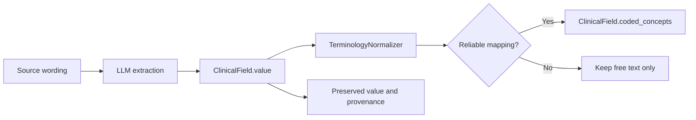

# Terminology normalization

Bulkinout adds terminology annotations to clinical facts without replacing the extracted value or its provenance. The feature is deliberately conservative: an unmapped or uncertain concept remains valid free text.

## Data flow



`CodedConcept` records:

| Property | Meaning |
|---|---|
| `system` | Stable terminology URI, such as `http://unitsofmeasure.org`. |
| `code` | Code in that system. |
| `display` | Developer-readable preferred label. |
| `original_text` | Exact value or fragment that produced the annotation. |
| `version` | Optional terminology release identifier. |
| `normalized_value` | Optional JSON value associated with a unit annotation. |

Normalization runs after Core extraction and again after clarification answers are applied. The second pass operates on Request's deep copy, so `run_request_from_core()` still avoids document extraction and never mutates its Core baseline. Provider name, version, and content hash are stored under `ClinicalCase.metadata.terminology`.

## Built-in behavior

The default provider recognizes isolated numeric values expressed with a small set of common UCUM units: `umol/L`, `mmol/L`, `mg/dL`, `mg/L`, `g/L`, `mm[Hg]`, and `%`. It accepts selected typographic aliases, including `µmol/L`, but performs no unit conversion and does not infer a laboratory analyte.

No built-in provider assigns SNOMED CT, LOINC, or RadLex codes. `InMemoryTerminologyProvider` accepts caller-supplied, field-scoped mappings and supports multilingual synonyms. Matching is case- and accent-insensitive, uses term boundaries for acronyms, rejects negated mentions, and declines aliases shared by multiple concepts. This matcher is intentionally lexical; it is not a terminology server or a clinical NLP negation engine.

## Provider boundary

`TerminologyProvider.concepts_for(field_path, value)` returns zero or more `CodedConcept` objects. Build a `TerminologyNormalizer` from approved providers and inject it into `build_radiology_case()`, `run_request()`, or `run_request_from_core()`.

```python
from pathlib import Path

from bulkinout import run_request
from bulkinout.core.normalization import (
    InMemoryTerminologyProvider,
    TerminologyEntry,
    TerminologyNormalizer,
)

entries = load_organization_approved_entries()  # Not shipped by Bulkinout.
provider = InMemoryTerminologyProvider(entries, name="local_terms", version="2026-09")
normalizer = TerminologyNormalizer([provider])
result = run_request(Path("input"), terminology_normalizer=normalizer)
```

Providers may use SNOMED CT, LOINC, RadLex, another controlled vocabulary, or a local namespace. They own licensing, release selection, lookup quality, and update procedures. Do not send source text to a remote terminology service without an approved data-processing boundary.

Reference YAML may opt into code-based matching with `concept_is` or `concept_in`. Existing value and substring operators remain available as fallback, and the 18 bundled scenarios continue to use their existing multilingual rules.

## Terminology and licensing decisions

Bulkinout does not redistribute terminology datasets.

| Standard | Intended use | Repository decision |
|---|---|---|
| SNOMED CT | Clinical findings, disorders, procedures, and other clinical concepts | Supported through providers; no content bundled because use and distribution depend on SNOMED International affiliate and national licensing conditions. |
| LOINC | Laboratory and clinical observations | Supported through providers; no table bundled. Reliable mapping usually requires analyte, specimen, method, and property context that current generic fields may not provide. |
| UCUM | Units of measure | A small syntax recognizer is built in; no UCUM table or specification is copied. |
| RadLex | Radiology-specific anatomy, observations, and procedures | Supported through providers; no ontology or Playbook content bundled. |

Review the authoritative terms before configuring a provider: [SNOMED CT licensing](https://docs.snomed.org/snomed-ct-practical-guides/vendor-introduction-to-snomed-ct/7-licensing), [LOINC license](https://loinc.org/kb/license/), [UCUM license](https://ucum.org/license), and [RadLex license and attribution](https://www.rsna.org/practice-tools/data-tools-and-standards/radlex-radiology-lexicon). See also [`THIRD_PARTY_NOTICES.md`](../THIRD_PARTY_NOTICES.md).

## Known limits

- Extraction still determines which field and text reach normalization.
- Negation handling covers common French and English lexical forms, not every grammatical construction.
- No hierarchy, subsumption, post-coordination, terminology-server validation, or automatic version update is implemented.
- Unit annotations do not convert, compare, or validate reference ranges.
- A code is an annotation, not proof that the underlying clinical fact is correct.
- pydicom and highdicom are not Core dependencies. A future DICOM boundary may adapt `CodedConcept` to their DICOM-oriented code types.
