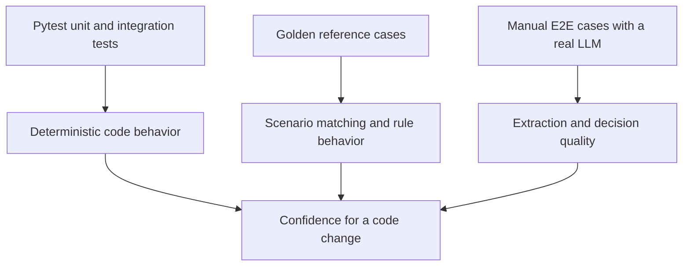

# Testing and validation

Bulkinout uses three complementary validation layers. They answer different questions and should not be treated as interchangeable.



## Fast automated suite

```bash
pytest -q
```

`pyproject.toml` automatically enables coverage for the `bulkinout` package and enforces a 95% floor. The suite covers:

- Pydantic models and serialization;
- file discovery;
- Core extraction helpers with simulated clients;
- answer loading and application;
- generic and modality-specific questions;
- decision guards;
- multilingual scenario matching, filtering, and rules;
- catalog generation;
- golden-case evaluation;
- Request-service orchestration plus thin CLI delegation with test doubles.

Tests must not call a real model unless they live in the explicit manual E2E layer. Inject small `CoreExtractor` and `RequestDecisionEngine` fakes to test service orchestration. Use a simulated SDK client only when testing the built-in OpenAI adapters themselves.

### Focused runs

```bash
pytest -q tests/test_extraction.py
pytest -q tests/test_reference_engine.py tests/test_reference_engine_v0.py
pytest -q tests/test_cli.py
pytest -q -k pregnancy
```

The global coverage threshold still applies to focused runs because it is configured in pytest options. During local debugging, use the full suite for the final result rather than weakening the repository threshold.

## Linting

```bash
ruff check src tests
ruff format --check src tests
mypy
```

Ruff is pinned in the development extra and owns linting, formatting, and a maximum cyclomatic complexity of 10. Mypy runs in strict mode over `src/`; dynamic provider responses are the only intentional `Any` boundary. Documentation is reviewed through link/content inspection rather than a Markdown linter.

## Golden cases

Golden cases in `tests/golden/*.yaml` build a `ClinicalCase` directly and evaluate the reference without an LLM.

```yaml
id: renal_colic_missing_pregnancy
facts:
  current_problem.location: "douleur du flanc droit"
expected:
  scenario: renal_colic
  must_ask_fields: [imaging_safety.pregnancy]
```

The evaluator supports these expectations:

| Key | Check |
|---|---|
| `scenario` | The named scenario must appear among matches. |
| `must_not_match` | None of the listed scenario IDs may match. |
| `must_trigger_rules` | Every listed rule ID must trigger. |
| `must_not_trigger_rules` | None of the listed rule IDs may trigger. |
| `must_ask_fields` | Every listed field must appear among material unresolved questions. |
| `must_not_ask_fields` | Listed fields must not appear among material unresolved questions. |
| `preferred_candidate` | A triggered rule must select this candidate ID. |
| `no_imaging_recommended` | At least one triggered rule must return `true`. |

Run all golden cases directly:

```bash
bulkinout request golden \
  --cases tests/golden \
  --reference reference/scenarios
```

They also run through pytest, but the CLI output is useful while authoring reference changes.

### When to add a golden case

Add or update one before changing:

- scenario entry predicates or synonyms;
- a field path used by a question or rule;
- candidate `when` conditions;
- rule predicates or results;
- question materiality;
- matching or scoring behavior in `ReferenceEngine`.

Preserve French cases when adding English synonyms. For multilingual changes, cover both languages without replacing the original input fixture.

## Manual end-to-end cases

`tests/e2e/` contains synthetic patient records split across realistic documents. These cases exercise the full path through a configured model and therefore are not run by pytest or CI.

Each directory contains:

```text
case_name/
├── one or more synthetic patient documents
├── expected.json
└── answers_after_call.example.json   # only when a clarification pass is relevant
```

Developer-facing intent and keys in `expected.json` use English. French strings remain where they assert current clinical presentation.

Run a case into a dedicated directory:

```bash
export OPENAI_API_KEY="..."
export BULKINOUT_MODEL="<compatible-model>"

bulkinout request run \
  --input tests/e2e/case_001_rlq_complete \
  --output output_e2e/case_001
```

Then compare the generated files against `expected.json` and record findings in `review/radiologist_review_template.csv`.

### Review order

1. Confirm that required Core fields were extracted.
2. Check that prohibited facts were not invented.
3. Inspect provenance and contradictions.
4. Confirm scenario matching and decision status.
5. Check questions, proposed examination, and safety surfaces.
6. Review the French teleradiology draft for correctness and clarity.
7. Record any error under the owning layer, not only under the final symptom.

The review template recognizes `core_extraction`, `scenario_matching`, `reference_question`, `reference_rule`, `decision_llm`, `safety_guard`, `request_generation`, and `other`.

## Continuous integration

`.github/workflows/ci.yml` runs two parallel validation paths on pushes and pull requests:

```text
GitHub Actions
├── quality and package — Python 3.11
│   ├── Ruff lint + format check
│   ├── strict mypy
│   ├── wheel and source distribution build
│   └── installed-wheel catalog smoke test from outside the repository
└── tests — Python 3.11 and 3.14
    ├── pytest with ≥95% coverage
    └── golden-case CLI
```

CI validates the deterministic repository and its installable package boundaries. The wheel smoke test changes to an unrelated directory and verifies that the packaged catalog still exposes all 18 scenarios. Quality and test jobs run in parallel, pip downloads are cached, superseded runs on the same ref are cancelled, and each job has a ten-minute timeout. CI does not require secrets or run E2E model calls. A green workflow means static checks, package construction, tests, coverage, and encoded golden behavior passed; it does not imply local reference validation or clinical approval.

## Turning failures into durable tests

| Observed failure | First artifact to inspect | Regression test |
|---|---|---|
| Fact missing or invented | `llm_extraction.json` | Extraction test with a simulated response; retain an E2E fixture for model evaluation. |
| Fact stored under wrong path | `case.json` | `test_extraction.py` conversion case. |
| Scenario not matched | `reference_context.json` | French and English reference-engine tests plus a golden case. |
| Wrong rule triggered | `reference_context.json` | Focused golden case. |
| Unsafe selected state | `imaging_decision.json` | Decision-guard or Request-service test. |
| Incorrect clinical draft | `teleradiology_request.json` | Request-builder test and manual E2E review. |

## Pre-merge checklist

```bash
ruff check src tests
ruff format --check src tests
mypy
pytest -q
bulkinout request golden --cases tests/golden --reference reference/scenarios
python -m build
git diff --check
```

If terminology, matching, prompts, or user-facing clinical content changed, also run the relevant manual E2E cases when credentials and an approved test environment are available.
